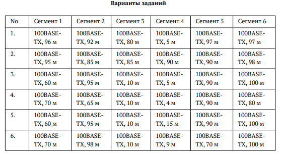
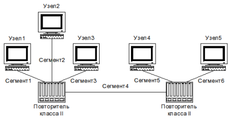

---
## Author
author:
  name: Цыкунова Екатерина Михайловна
  email: 1132246732@rudn.ru
  affiliation:
    - name: Российский университет дружбы народов
      country: Российская Федерация
      postal-code: 117198
      city: Москва
      address: ул. Миклухо-Маклая, д. 6

## Title
title: Домашнее задание №2
subtitle: Расчёт сети Fast Ethernet
license: CC BY
date: today
date-format: "YYYY-MM-DD"
---

# Цели и задачи работы

## Цель работы

Изучить принципы технологий Ethernet и Fast Ethernet и практически освоить методики оценки работоспособности сети Fast Ethernet.

## Задачи работы

- рассмотреть топологию сети Fast Ethernet;
- определить наиболее длинный путь между оконечными узлами;
- проверить сеть по первой модели Fast Ethernet;
- рассчитать время двойного оборота сигнала по второй модели;
- сравнить результаты расчётов с допустимыми значениями;
- сделать вывод о работоспособности вариантов сети.

# Исходные данные

## Варианты длин сегментов сети

{ #fig:001 width=80% height=80% }

## Топология исследуемой сети

{ #fig:002 width=70% height=70% }

## Описание исследуемой сети

Исследуемая сеть состоит из пяти оконечных узлов и двух повторителей класса II.

Узлы 1–3 подключены к первому повторителю, узлы 4–5 — ко второму повторителю.

Повторители соединены между собой сегментом 4.

## Условия первой модели

Все сегменты сети работают по технологии 100BASE-TX.

Максимальная длина одного сегмента на витой паре составляет 100 м.

Для сети 100BASE-TX с двумя повторителями класса II максимально допустимый диаметр домена коллизий составляет 205 м.

## Результаты проверки по первой модели

| Вариант | Диаметр домена коллизий, м | Допустимое значение, м | Результат |
|:---:|:---:|:---:|:---|
| 1 | 198 | 205 | сеть работоспособна |
| 2 | 283 | 205 | сеть неработоспособна |
| 3 | 200 | 205 | сеть работоспособна |
| 4 | 164 | 205 | сеть работоспособна |
| 5 | 210 | 205 | сеть неработоспособна |
| 6 | 207 | 205 | сеть неработоспособна |

## Условия второй модели

Во второй модели рассчитывается время двойного оборота сигнала для наиболее длинного пути между двумя оконечными узлами.

Для работоспособной сети итоговое время двойного оборота не должно превышать 512 битовых интервалов.

## Результаты расчёта по второй модели

| Вариант | Длина наиболее длинного пути, м | Время двойного оборота, би | Допустимое значение, би | Результат |
|:---:|:---:|:---:|:---:|:---|
| 1 | 198 | 508,176 | 512 | сеть работоспособна |
| 2 | 283 | 602,696 | 512 | сеть неработоспособна |
| 3 | 200 | 510,4 | 512 | сеть работоспособна |
| 4 | 164 | 470,368 | 512 | сеть работоспособна |
| 5 | 210 | 521,52 | 512 | сеть неработоспособна |
| 6 | 207 | 518,184 | 512 | сеть неработоспособна |

# Итоговая оценка сети

## Сравниваю результаты двух моделей

| Вариант | Первая модель | Вторая модель | Итог |
|:---:|:---:|:---:|:---|
| 1 | проходит | проходит | сеть работоспособна |
| 2 | не проходит | не проходит | сеть неработоспособна |
| 3 | проходит | проходит | сеть работоспособна |
| 4 | проходит | проходит | сеть работоспособна |
| 5 | не проходит | не проходит | сеть неработоспособна |
| 6 | не проходит | не проходит | сеть неработоспособна |

## Вывод

В ходе работы была выполнена проверка сети Fast Ethernet по первой и второй моделям.

По первой модели был определён диаметр домена коллизий для каждого варианта сети.

По второй модели было рассчитано время двойного оборота сигнала с учётом задержек кабеля, оконечных устройств, двух повторителей класса II и страхового запаса.

Варианты 1, 3 и 4 удовлетворяют требованиям обеих моделей Fast Ethernet.

Варианты 2, 5 и 6 не удовлетворяют требованиям Fast Ethernet, так как расчётные значения превышают допустимые ограничения.
