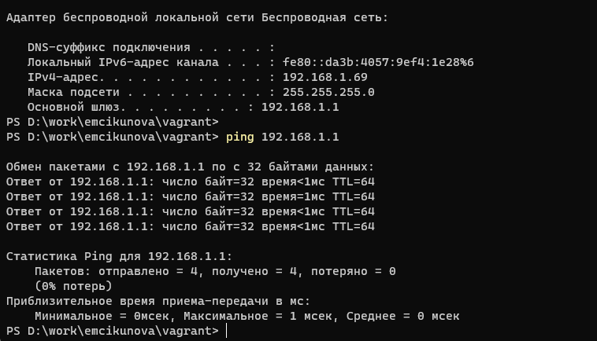
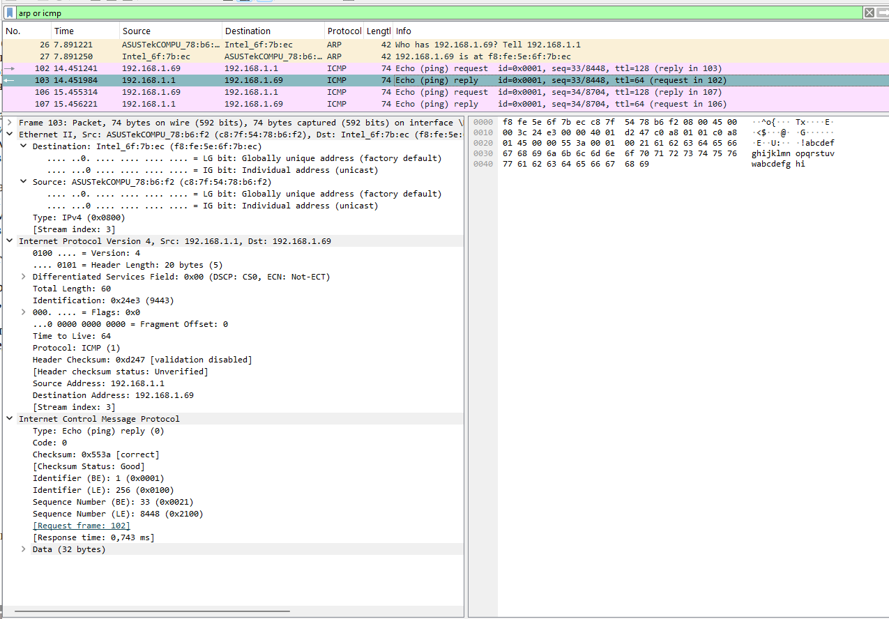
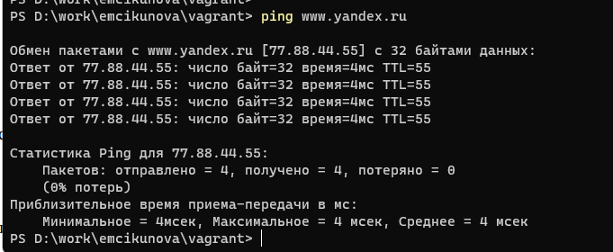
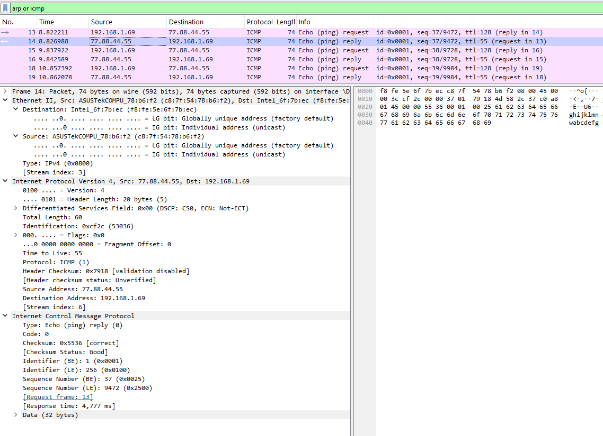
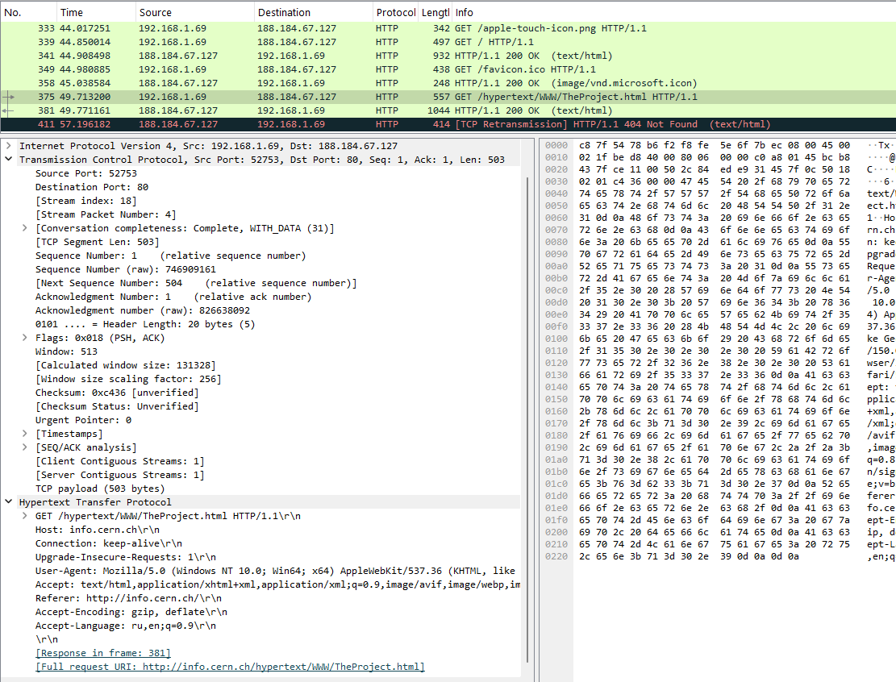
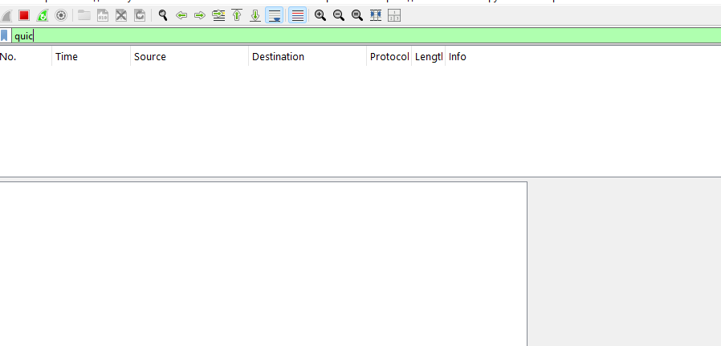
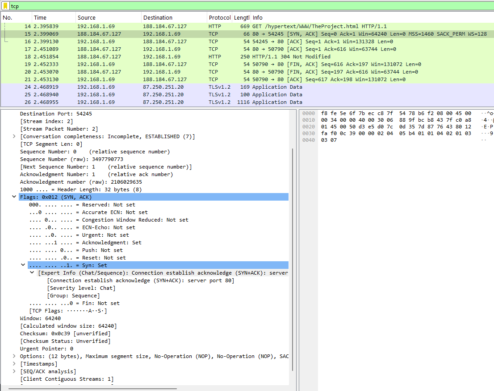
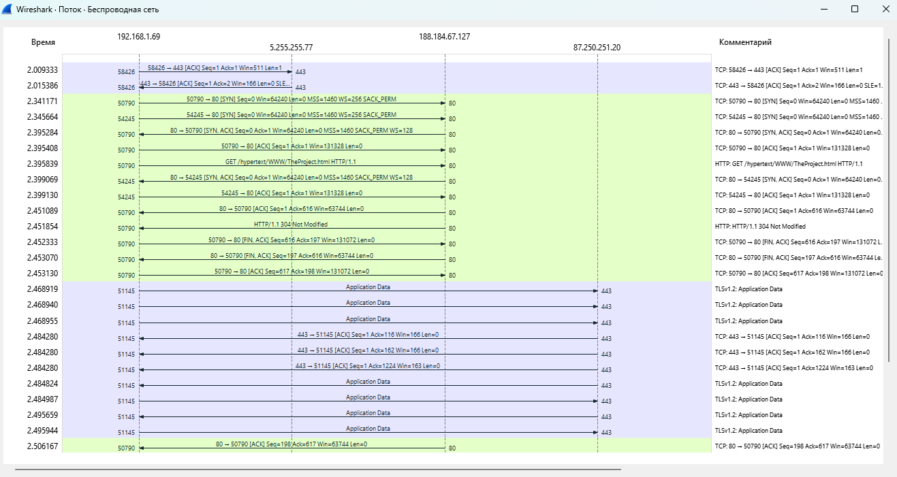

---
## Author
author:
  name: Цыкунова Екатерина Михайловна
  email: 1132246732@rudn.ru
  affiliation:
    - name: Российский университет дружбы народов
      country: Российская Федерация
      postal-code: 117198
      city: Москва
      address: ул. Миклухо-Маклая, д. 6

## Title
title: Домашнее задание №3
subtitle: Анализ трафика в Wireshark
license: CC BY
date: today
date-format: "YYYY-MM-DD"
---

# Цели и задачи работы

## Цель лабораторной работы

Изучить MAC-адресацию и выполнить анализ сетевого трафика в Wireshark на канальном и транспортном уровнях.

## Задачи лабораторной работы

- определить IP- и MAC-адреса сетевых интерфейсов;
- проанализировать кадры ARP и ICMP;
- изучить HTTP, DNS и QUIC-трафик;
- проанализировать TCP handshake.

# Процесс выполнения лабораторной работы

## Определяю параметры сетевого подключения

{ #fig:001 width=70% height=70% }

## Определяю MAC-адреса устройств

{ #fig:002 width=70% height=70% }

## Анализирую ICMP Echo Reply

{ #fig:003 width=70% height=70% }

## Анализирую ARP-запрос

{ #fig:004 width=70% height=70% }

## Анализирую ARP-ответ

{ #fig:005 width=70% height=70% }

## Проверяю доступность удалённого узла

{ #fig:006 width=70% height=70% }

## Изучаю ICMP-запрос к удалённому узлу

{ #fig:007 width=70% height=70% }

## Изучаю ICMP-ответ от удалённого узла

{ #fig:008 width=70% height=70% }

## Анализирую HTTP-запрос

{ #fig:009 width=70% height=70% }

## Анализирую HTTP-ответ

{ #fig:010 width=70% height=70% }

## Анализирую DNS-запрос

{ #fig:011 width=70% height=70% }

## Анализирую DNS-ответ

{ #fig:012 width=70% height=70% }

## Проверяю наличие QUIC-трафика

{ #fig:013 width=70% height=70% }

## Анализирую TLS поверх TCP

{ #fig:014 width=70% height=70% }

## Анализирую TCP handshake

{ #fig:015 width=70% height=70% }

## Строю график потока TCP

{ #fig:016 width=70% height=70% }

## Вывод

В ходе лабораторной работы были изучены MAC-адреса сетевых интерфейсов и их структура.

С помощью Wireshark были проанализированы кадры ARP и ICMP. Было установлено, что при обращении к удалённому узлу кадры Ethernet передаются на MAC-адрес шлюза по умолчанию.

Также были рассмотрены протоколы HTTP, DNS и TLS. HTTP использовал TCP, DNS-запросы передавались по UDP, а QUIC-трафик в захвате отсутствовал.

Отдельно был изучен процесс установки TCP-соединения. Handshake выполнялся по схеме `SYN → SYN, ACK → ACK`, после чего начиналась передача прикладных данных.