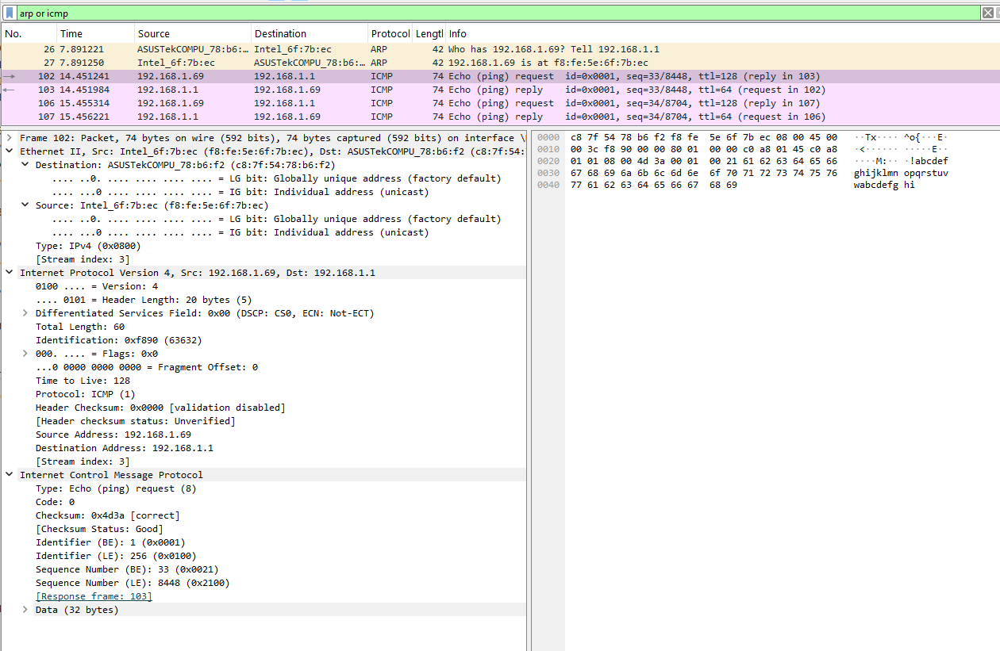
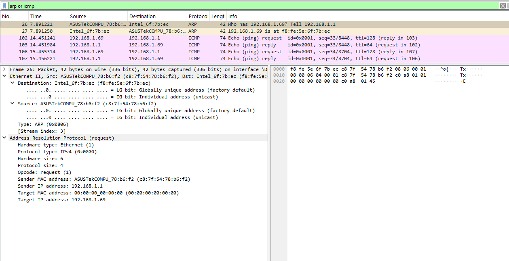
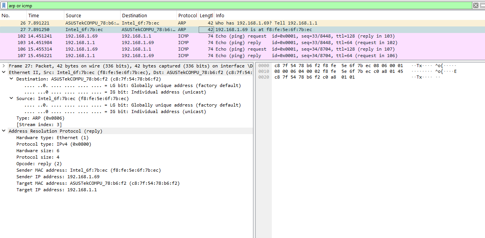
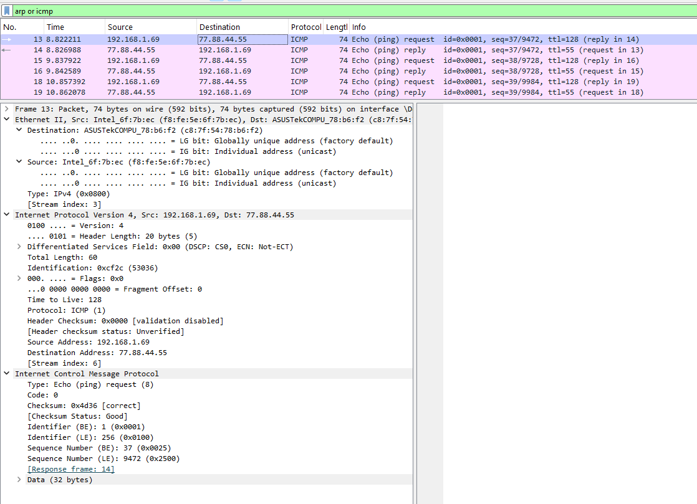
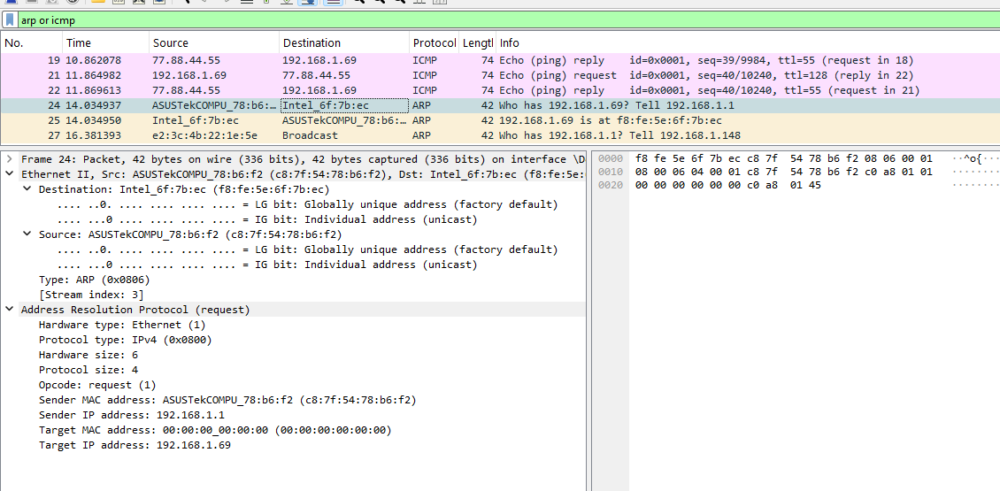
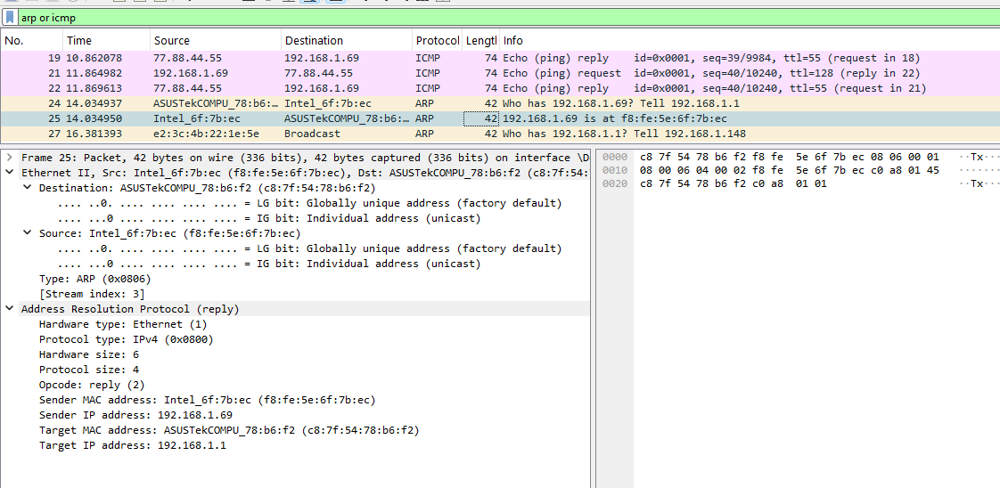
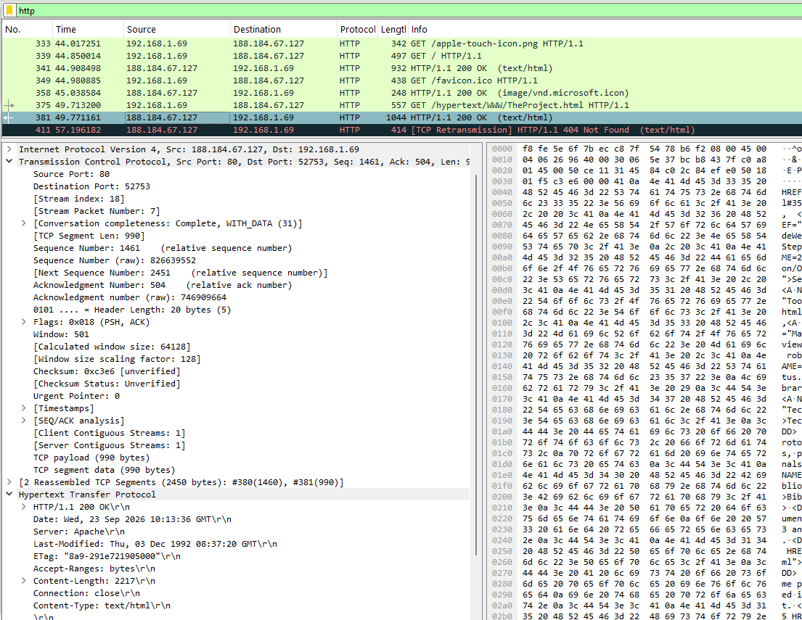
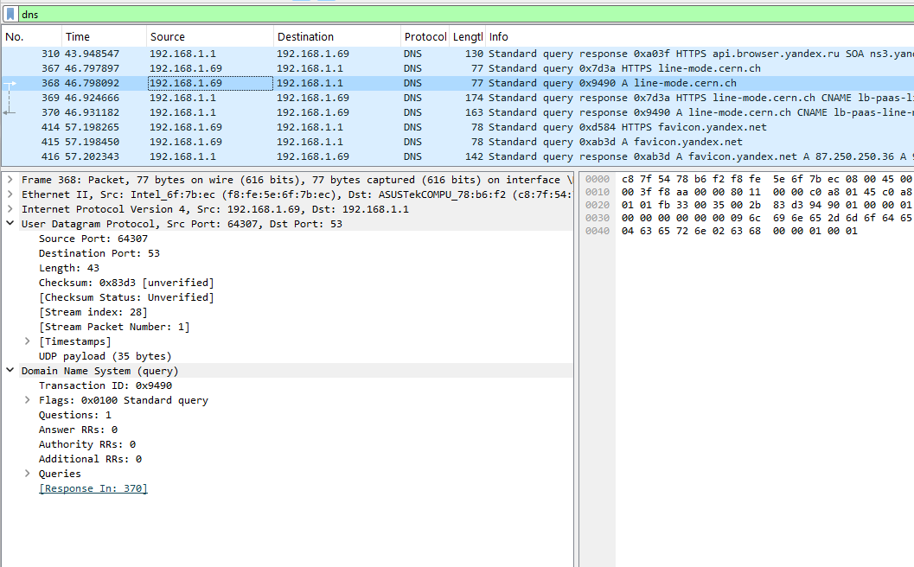
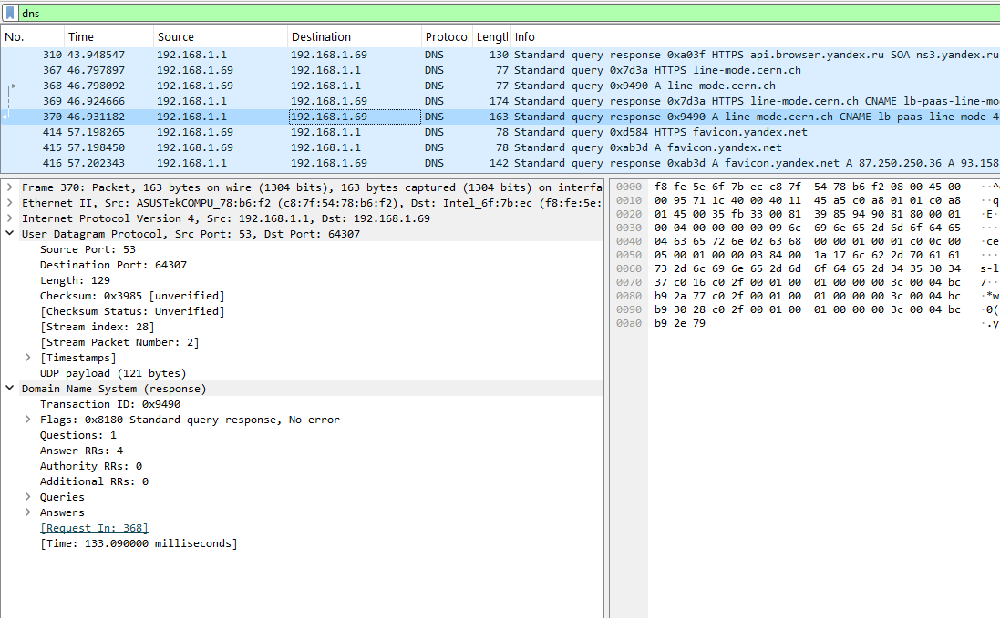
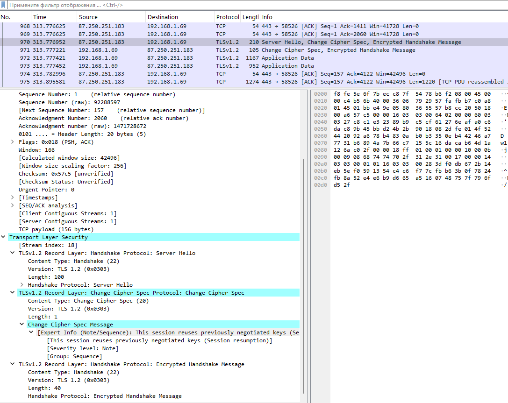

---
## Author
author:
  name: Цыкунова Екатерина Михайловна
  email: 1132246732@rudn.ru
  affiliation:
    - name: Российский университет дружбы народов
      country: Российская Федерация
      postal-code: 117198
      city: Москва
      address: ул. Миклухо-Маклая, д. 6

## Title
title: "Отчёт по домашнему заданию №3"
subtitle: "Анализ трафика в Wireshark"
license: "CC BY"
---

# Цель работы

Изучение посредством Wireshark кадров Ethernet, анализ PDU протоколов транспортного и прикладного уровней стека TCP/IP.

# Выполнение лабораторной работы

## MAC-адресация

Для определения параметров текущего сетевого подключения использую команду `ipconfig` в Windows. В выводе для активного адаптера беспроводной сети отображаются основные параметры сетевого уровня: локальный IPv6-адрес канала, IPv4-адрес, маска подсети и основной шлюз. Активному сетевому интерфейсу назначен IPv4-адрес `192.168.1.69`, маска подсети `255.255.255.0`, что соответствует префиксу `/24`, а в качестве основного шлюза используется адрес `192.168.1.1` (см. рис. [@fig-001]).

{ #fig-001 width=70% }

Команда `ipconfig` без дополнительных параметров выводит краткие сведения о сетевых интерфейсах. Для получения расширенной информации использую команду `ipconfig /all`. В расширенном выводе дополнительно доступны описание сетевого адаптера, физический MAC-адрес, состояние DHCP, адрес DHCP-сервера, DNS-серверы, DNS-суффикс, параметры IPv6 и сведения об аренде IP-адреса. Для активного беспроводного интерфейса физический адрес имеет значение `F8-FE-5E-6F-7B-EC`.

Полученный MAC-адрес также наблюдаю непосредственно в захваченных Wireshark кадрах. В заголовке Ethernet II сетевой интерфейс компьютера определяется как `Intel_6f:7b:ec`, а его полный адрес равен `f8:fe:5e:6f:7b:ec`. MAC-адрес второго участника локального соединения — маршрутизатора — равен `c8:7f:54:78:b6:f2` и определяется Wireshark как устройство ASUSTek (см. рис. [@fig-002]).

{ #fig-002 width=90% }

MAC-адрес представляет собой 48-битное значение, состоящее из шести октетов. Для сетевого интерфейса компьютера используется адрес:

`F8:FE:5E:6F:7B:EC`

Первые 24 бита, то есть первые три октета `F8:FE:5E`, представляют собой идентификатор организации OUI и определяют производителя сетевого оборудования. Wireshark по этому значению определяет производителя как Intel. Последние 24 бита `6F:7B:EC` идентифицируют конкретный сетевой интерфейс в пределах адресного пространства производителя.

Для определения типа MAC-адреса рассматриваю первый октет `F8`. В двоичном виде он имеет значение:

`F8 = 11111000₂`

Младший бит I/G равен `0`, следовательно, адрес является индивидуальным, то есть unicast. Второй младший бит U/L также равен `0`, поэтому адрес является глобально администрируемым, то есть назначенным производителем, а не сформированным локально программным обеспечением.

Для MAC-адреса маршрутизатора `C8:7F:54:78:B6:F2` первый октет `C8` имеет вид `11001000₂`. Биты I/G и U/L также равны `0`, поэтому MAC-адрес маршрутизатора является индивидуальным и глобально администрируемым.

## Анализ кадров канального уровня в Wireshark

Запускаю Wireshark и выбираю активный беспроводной сетевой интерфейс. В консоли определяю IP-адрес компьютера `192.168.1.69` и адрес основного шлюза `192.168.1.1`. Для проверки соединения со шлюзом выполняю команду `ping 192.168.1.1`. Получаю четыре ответа, потери пакетов отсутствуют, а время ответа составляет не более `1 мс`, что подтверждает доступность маршрутизатора в локальной сети (см. рис. [@fig-001]).

После выполнения `ping` останавливаю захват и применяю фильтр отображения:

`arp or icmp`

В списке остаются ARP- и ICMP-пакеты, относящиеся к определению адресов канального уровня и проверке доступности шлюза.

Выбираю ICMP Echo Request от компьютера к шлюзу. Длина Ethernet-кадра составляет `74` байта, или `592` бита. Используется формат `Ethernet II`, а значение поля `Type` равно `0x0800`, что обозначает передачу пакета IPv4. MAC-адрес источника равен `f8:fe:5e:6f:7b:ec`, а MAC-адрес назначения — `c8:7f:54:78:b6:f2`. Оба адреса являются индивидуальными и глобально администрируемыми. На сетевом уровне источник имеет IP-адрес `192.168.1.69`, назначение — `192.168.1.1`. ICMP-сообщение имеет тип `8`, то есть Echo Request, и содержит `32` байта данных (см. рис. [@fig-002]).

Выбираю соответствующий ICMP Echo Reply. Длина кадра также равна `74` байтам, используется `Ethernet II` с типом `IPv4 (0x0800)`. В ответном кадре адреса меняются местами: источником является маршрутизатор с MAC-адресом `c8:7f:54:78:b6:f2`, а получателем — компьютер с MAC-адресом `f8:fe:5e:6f:7b:ec`. На сетевом уровне пакет передаётся от `192.168.1.1` к `192.168.1.69`. ICMP имеет тип `0`, соответствующий Echo Reply. Для выбранной пары Wireshark показывает время ответа около `0,743 мс` (см. рис. [@fig-003]).

{ #fig-003 width=90% }

Далее анализирую ARP-сообщения. В выбранном ARP Request маршрутизатор с IP-адресом `192.168.1.1` запрашивает сведения об узле `192.168.1.69`. В заголовке Ethernet II источником является `c8:7f:54:78:b6:f2`, а назначением — `f8:fe:5e:6f:7b:ec`. Значение EtherType `0x0806` обозначает ARP. В самом ARP-заголовке аппаратный тип равен `Ethernet (1)`, тип протокола — `IPv4 (0x0800)`, длина аппаратного адреса — `6` байт, длина протокольного адреса — `4` байта, а поле `Opcode` имеет значение `1`, то есть запрос. В поле Target MAC Address содержится `00:00:00:00:00:00`, поскольку именно MAC-адрес узла `192.168.1.69` необходимо определить (см. рис. [@fig-004]).

В данном захвате Ethernet-кадр ARP-запроса передаётся непосредственно на MAC-адрес компьютера, а не на широковещательный `ff:ff:ff:ff:ff:ff`. Это возможно при обновлении или проверке уже существующей записи ARP-кэша, когда MAC-адрес узла на канальном уровне ранее был известен.

{ #fig-004 width=90% }

В следующем кадре компьютер формирует ARP Reply. Поле `Opcode` принимает значение `2`. Отправителем является узел `192.168.1.69` с MAC-адресом `f8:fe:5e:6f:7b:ec`, получателем — маршрутизатор `192.168.1.1` с MAC-адресом `c8:7f:54:78:b6:f2`. Длина кадра составляет `42` байта. Ответ сообщает маршрутизатору соответствие IP-адреса `192.168.1.69` физическому адресу `f8:fe:5e:6f:7b:ec` (см. рис. [@fig-005]).

{ #fig-005 width=90% }

Начинаю новый захват трафика и выполняю проверку удалённого узла по доменному имени командой:

`ping www.yandex.ru`

Имя `www.yandex.ru` разрешается в IPv4-адрес `77.88.44.55`. Получаю четыре ответа с временем около `4–5 мс`, потери отсутствуют. Значение TTL в ответах составляет `55` (см. рис. [@fig-006]).

{ #fig-006 width=70% }

В Wireshark выбираю ICMP Echo Request к адресу `77.88.44.55`. На сетевом уровне пакет имеет источник `192.168.1.69` и назначение `77.88.44.55`. При этом на канальном уровне MAC-адресом назначения является не MAC-адрес удалённого сервера, а MAC-адрес локального шлюза `c8:7f:54:78:b6:f2`. Это связано с тем, что `77.88.44.55` находится за пределами локальной сети `192.168.1.0/24`, поэтому компьютер передаёт Ethernet-кадр ближайшему маршрутизатору. MAC-адрес источника равен `f8:fe:5e:6f:7b:ec`. Длина кадра составляет `74` байта, а ICMP-сообщение имеет тип Echo Request (см. рис. [@fig-007]).

{ #fig-007 width=90% }

В ответном кадре IP-адресом источника является удалённый узел `77.88.44.55`, а адресом назначения — `192.168.1.69`. Однако на канальном уровне источником кадра снова является локальный маршрутизатор `c8:7f:54:78:b6:f2`, поскольку именно он передаёт полученный из внешней сети IP-пакет компьютеру. Получателем Ethernet-кадра является `f8:fe:5e:6f:7b:ec`. ICMP имеет тип Echo Reply, длина кадра равна `74` байтам, а время ответа для выбранной пары составляет около `4,777 мс` (см. рис. [@fig-008]).

{ #fig-008 width=90% }

В том же захвате наблюдаю повторный обмен ARP между маршрутизатором и компьютером. Маршрутизатор `192.168.1.1` отправляет ARP Request для адреса `192.168.1.69`. Источником Ethernet-кадра является `c8:7f:54:78:b6:f2`, а назначением — `f8:fe:5e:6f:7b:ec` (см. рис. [@fig-009]).

{ #fig-009 width=90% }

Компьютер отвечает ARP Reply, сообщая маршрутизатору, что IP-адресу `192.168.1.69` соответствует MAC-адрес `f8:fe:5e:6f:7b:ec`. В Ethernet II источником становится компьютер, а получателем — маршрутизатор (см. рис. [@fig-010]).

{ #fig-010 width=90% }

Таким образом, при взаимодействии внутри локальной сети Ethernet-кадры передаются непосредственно между MAC-адресами локальных узлов. При обращении к удалённому IP-адресу MAC-адрес назначения соответствует шлюзу по умолчанию, поскольку MAC-адреса действуют только в пределах текущего канального сегмента.

## Анализ протоколов транспортного уровня в Wireshark

Запускаю новый захват трафика и в браузере открываю HTTP-сайт CERN `http://info.cern.ch/`. После получения страниц применяю в Wireshark фильтр:

`http`

В захвате отображаются HTTP-запросы от локального узла `192.168.1.69` к серверу `188.184.67.127` и ответы сервера. Для выбранного запроса используется TCP-соединение с исходным портом `52753` и портом назначения `80`. TCP-сегмент содержит флаги `PSH, ACK`, относительный номер последовательности `Seq=1`, номер подтверждения `Ack=1` и `503` байта полезных данных TCP.

На прикладном уровне передаётся запрос:

`GET /hypertext/WWW/TheProject.html HTTP/1.1`

В поле `Host` указано `info.cern.ch`. Также передаются заголовки `Connection: keep-alive`, `User-Agent`, `Accept`, `Referer`, `Accept-Encoding` и `Accept-Language`. Wireshark связывает запрос с соответствующим ответом сервера (см. рис. [@fig-011]).

{ #fig-011 width=90% }

В ответ сервер `188.184.67.127` передаёт данные с TCP-порта `80` на клиентский порт `52753`. Выбранный TCP-сегмент содержит флаги `PSH, ACK`, относительный `Seq=1461`, `Ack=504` и `990` байт TCP payload. Wireshark выполняет сборку нескольких TCP-сегментов в единое HTTP-сообщение.

HTTP-сервер возвращает статус:

`HTTP/1.1 200 OK`

В заголовках ответа отображаются сервер `Apache`, тип содержимого `text/html`, длина содержимого `2217` байт и `Connection: close`. Следовательно, HTTP использует TCP как надёжный транспортный протокол: номера последовательности обеспечивают правильный порядок данных, а номера подтверждений позволяют контролировать их получение (см. рис. [@fig-012]).

{ #fig-012 width=90% }

Для анализа разрешения доменных имён применяю фильтр:

`dns`

В выбранном запросе компьютер `192.168.1.69` обращается к DNS-серверу `192.168.1.1`. DNS работает поверх UDP. Исходный UDP-порт клиента равен `64307`, порт назначения — стандартный DNS-порт `53`. Длина UDP-дейтаграммы составляет `43` байта. DNS-запрос имеет идентификатор транзакции `0x9490` и запрашивает IPv4-запись типа `A` для имени `line-mode.cern.ch`. В запросе содержится один вопрос, а число ответов равно нулю, поскольку это запрос клиента (см. рис. [@fig-013]).

{ #fig-013 width=90% }

DNS-сервер `192.168.1.1` формирует ответ на адрес `192.168.1.69`. UDP-порт источника равен `53`, а порт назначения — `64307`. Идентификатор DNS-транзакции остаётся `0x9490`, что позволяет сопоставить ответ исходному запросу. Флаги имеют значение `0x8180`, Wireshark определяет сообщение как `Standard query response, No error`. В ответе содержится четыре ресурсные записи. Время между выбранным запросом и ответом составляет приблизительно `133 мс` (см. рис. [@fig-014]).

{ #fig-014 width=90% }

Для поиска трафика QUIC применяю фильтр:

`quic`

После применения фильтра список пакетов остаётся пустым. Следовательно, в рассматриваемом захвате пакеты, распознанные Wireshark как QUIC, отсутствуют. При обращении к исследуемым ресурсам браузер в данном захвате использовал HTTP поверх TCP и HTTPS/TLS поверх TCP, а соединений QUIC, работающих поверх UDP, зафиксировано не было (см. рис. [@fig-015]).

{ #fig-015 width=70% }

Дополнительно в захваченном трафике наблюдаю соединение по TCP с удалённым узлом `87.250.251.183` через порт `443`. Поверх установленного TCP-соединения передаются сообщения `TLSv1.2`, в том числе `Server Hello`, `Change Cipher Spec` и зашифрованные сообщения handshake. После согласования криптографических параметров передаются записи `Application Data`. Это подтверждает использование TCP в качестве транспортного протокола для HTTPS/TLS-соединения в данном случае (см. рис. [@fig-016]).

{ #fig-016 width=90% }

## Анализ handshake протокола TCP в Wireshark

Для анализа процесса установки TCP-соединения применяю фильтр:

`tcp`

В захвате присутствуют TCP-соединения между локальным компьютером `192.168.1.69` и HTTP-сервером `188.184.67.127` на порту `80`. Рассматриваю соединение, в котором клиент использует динамический порт `50790`.

Первым этапом клиент `192.168.1.69:50790` отправляет серверу `188.184.67.127:80` сегмент с установленным флагом `SYN`. Относительный номер последовательности имеет значение `Seq=0`. Клиент объявляет размер окна `Win=64240`, максимальный размер TCP-сегмента `MSS=1460`, поддержку масштабирования окна `WS=256` и `SACK_PERM`.

Вторым этапом сервер отправляет в обратном направлении сегмент `SYN, ACK`. В нём используются `Seq=0` и `Ack=1`. Увеличение номера подтверждения до `1` связано с тем, что флаг `SYN` занимает одну позицию в пространстве последовательных номеров TCP. Сервер также объявляет окно `Win=64240`, `MSS=1460`, поддержку SACK и коэффициент масштабирования окна `WS=128`.

Третьим этапом клиент передаёт сегмент `ACK` с `Seq=1` и `Ack=1`, завершая трёхэтапное установление TCP-соединения. После этого соединение переходит в состояние `ESTABLISHED` и клиент может передавать HTTP-запрос. На скриншоте также наблюдается второе параллельное TCP-соединение с исходным портом `54245`, устанавливаемое по той же схеме. Для выбранного пакета `SYN, ACK` Wireshark отдельно показывает установленные флаги `SYN` и `ACK` и помечает его как `Connection establish acknowledge` (см. рис. [@fig-017]).

{ #fig-017 width=90% }

Для более наглядного представления обмена открываю меню `Статистика` и выбираю `График потока`. На графике отображаются направления передачи TCP-сегментов между `192.168.1.69` и `188.184.67.127`.

Для соединения `50790 → 80` последовательность установки соединения имеет вид:

`192.168.1.69:50790 → 188.184.67.127:80: SYN, Seq=0`

`188.184.67.127:80 → 192.168.1.69:50790: SYN, ACK, Seq=0, Ack=1`

`192.168.1.69:50790 → 188.184.67.127:80: ACK, Seq=1, Ack=1`

Сразу после третьего сообщения передаётся `GET /hypertext/WWW/TheProject.html HTTP/1.1`, что означает успешное завершение handshake. Далее сервер подтверждает получение данных и возвращает `HTTP/1.1 304 Not Modified`.

На графике также видно корректное завершение соединения с использованием флагов `FIN, ACK`: одна сторона сообщает о завершении передачи, другая подтверждает сообщение и также завершает свою часть соединения. Таким образом, график потока позволяет проследить полный жизненный цикл TCP-сеанса от установки соединения до его закрытия (см. рис. [@fig-018]).

{ #fig-018 width=95% }

В результате анализа устанавливаю, что канальный уровень Ethernet использует MAC-адреса только в пределах локального сегмента сети, ARP обеспечивает сопоставление IPv4- и MAC-адресов, а ICMP используется для диагностической проверки доступности узлов. На транспортном уровне HTTP передаётся поверх TCP, DNS в исследованных запросах работает поверх UDP, а трафик QUIC в выполненном захвате отсутствует. TCP обеспечивает установление соединения при помощи трёхэтапной последовательности `SYN → SYN, ACK → ACK`, после которой начинается передача прикладных данных.

# Вывод

В ходе лабораторной работы были изучены MAC-адреса сетевых интерфейсов и их структура, а также проанализирован сетевой трафик в Wireshark. Были рассмотрены протоколы ARP, ICMP, HTTP, DNS и TCP, определены особенности передачи данных на канальном и транспортном уровнях. Также был исследован процесс установки TCP-соединения с помощью трёхэтапного handshake `SYN → SYN, ACK → ACK`.