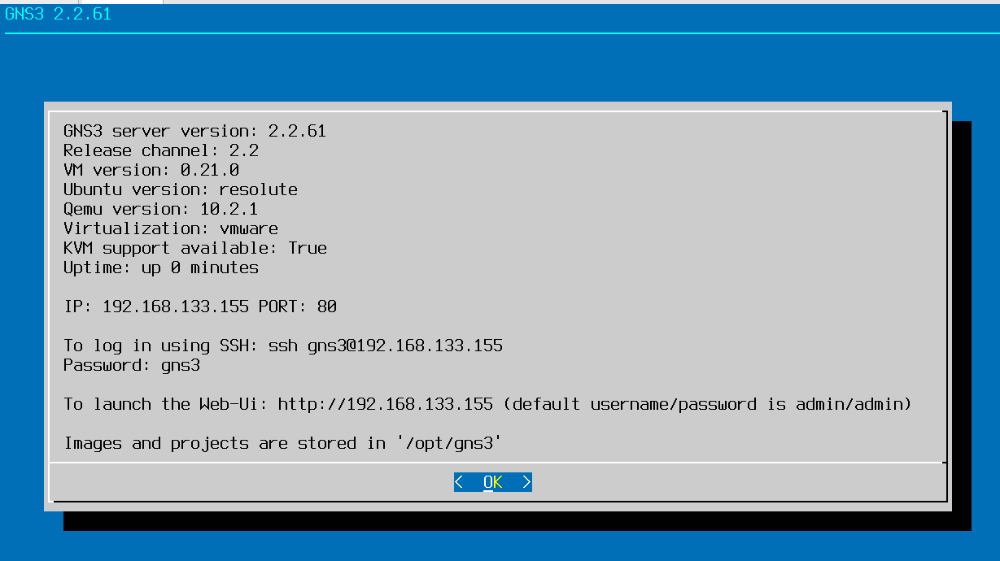
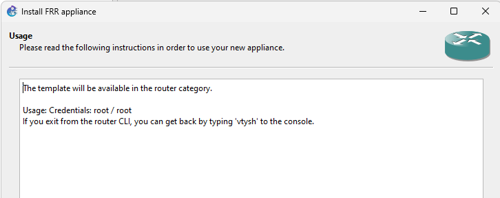
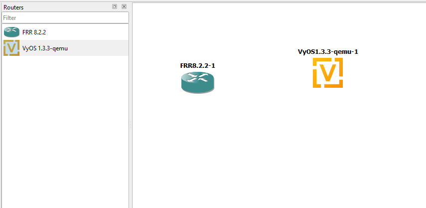
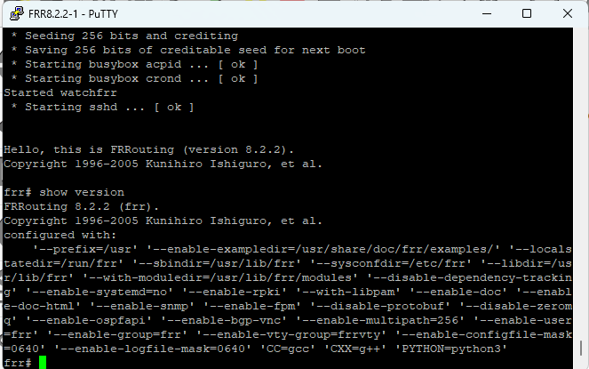

---
## Author
author:
  name:  Цыкунова Екатерина Михайловна
  email: 1132246732@rudn.ru
  affiliation:
    - name: Российский университет дружбы народов
      country: Российская Федерация
      postal-code: 117198
      city: Москва
      address: ул. Миклухо-Маклая, д. 6

## Title
title: Лабораторная работа №1
subtitle: Подготовка экспериментального стенда GNS3
license: CC BY
date: today
date-format: "YYYY-MM-DD"
---

# Цели и задачи работы

## Цель лабораторной работы

Целью данной работы является приобретение практических навыков установки и настройки GNS3, а также запуска и проверки работы виртуальных маршрутизаторов FRR и VyOS.

## Задачи лабораторной работы

- установить GNS3-all-in-one и GNS3 VM;
- проверить корректность запуска GNS3 VM;
- импортировать образ маршрутизатора FRR;
- импортировать образ маршрутизатора VyOS;
- добавить маршрутизаторы в проект GNS3;
- проверить корректность работы FRR и VyOS через консоль.

# Процесс выполнения лабораторной работы

## Проверяю запуск GNS3 VM

{ #fig:001 width=70% height=70% }

## Импортирую маршрутизатор FRR

{ #fig:002 width=70% height=70% }

## Импортирую маршрутизатор VyOS

{ #fig:003 width=70% height=70% }

## Добавляю маршрутизаторы в проект

{ #fig:004 width=70% height=70% }

## Проверяю работу FRR

{ #fig:005 width=70% height=70% }

## Проверяю работу VyOS

{ #fig:006 width=70% height=70% }

## Вывод

В ходе лабораторной работы были установлены и настроены GNS3 и GNS3 VM, а также импортированы образы маршрутизаторов FRR и VyOS.

Корректность работы маршрутизаторов была проверена путем их запуска и просмотра информации о версиях через консоль.