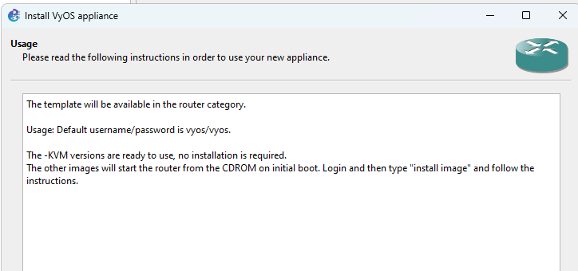
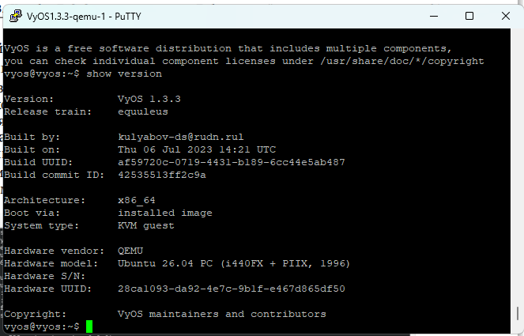

---
## Author
author:
  name:  Цыкунова Екатерина Михайловна
  email: 1132246732@rudn.ru
  affiliation:
    - name: Российский университет дружбы народов
      country: Российская Федерация
      postal-code: 117198
      city: Москва
      address: ул. Миклухо-Маклая, д. 6

## Title
title: "Отчёт по лабораторной работе №1"
subtitle: "Подготовка экспериментального стенда GNS3"
license: "CC BY"
---

# Цель работы

Установка и настройка GNS3 и сопутствующего программного обеспечения.

# Выполнение лабораторной работы

Устанавливаю GNS3-all-in-one и GNS3 VM. После запуска виртуальной машины проверяю корректность её работы. GNS3 VM успешно запускается, получает IP-адрес и предоставляет возможность подключения к серверу GNS3 (см. рис. [@fig-001]).

{ #fig-001 width=70% }

Импортирую в GNS3 образ маршрутизатора FRR. После завершения установки шаблон маршрутизатора становится доступен в категории маршрутизаторов GNS3 (см. рис. [@fig-002]).

{ #fig-002 width=70% }

Импортирую в GNS3 образ маршрутизатора VyOS. После завершения установки шаблон VyOS также становится доступен в категории маршрутизаторов (см. рис. [@fig-003]).

{ #fig-003 width=70% }

Добавляю импортированные маршрутизаторы FRR и VyOS в рабочую область проекта GNS3. Оба шаблона успешно отображаются в списке доступных маршрутизаторов и могут быть запущены в составе проекта (см. рис. [@fig-004]).

{ #fig-004 width=70% }

Запускаю маршрутизатор FRR и открываю его консоль. Для проверки корректности работы выполняю команду `show version`. Маршрутизатор успешно загружается и отображает сведения об установленной версии FRRouting 8.2.2 (см. рис. [@fig-005]).

{ #fig-005 width=70% }

Запускаю маршрутизатор VyOS и подключаюсь к его консоли. Для проверки корректности работы выполняю команду `show version`. Система успешно загружается и отображает сведения об установленной версии VyOS 1.3.3 (см. рис. [@fig-006]).

{ #fig-006 width=70% }

Таким образом, GNS3-all-in-one и GNS3 VM установлены и корректно запускаются. Образы маршрутизаторов FRR и VyOS успешно импортированы в GNS3, а проверка через консоль подтверждает их корректную работу.

# Вывод

В ходе лабораторной работы был установлен и проверен программный комплекс GNS3, а также подготовлена среда для моделирования сетевой инфраструктуры. В GNS3 были успешно импортированы и запущены образы маршрутизаторов FRR 8.2.2 и VyOS 1.3.3. Работоспособность обоих маршрутизаторов была подтверждена с помощью команд просмотра версии системы.
