---
## Author
author:
  name:  Цыкунова Екатерина Михайловна
  email: 1132246732@rudn.ru
  affiliation:
    - name: Российский университет дружбы народов
      country: Российская Федерация
      postal-code: 117198
      city: Москва
      address: ул. Миклухо-Маклая, д. 6

## Title
title: Лабораторная работа №2
subtitle: Простые сети в GNS3. Анализ трафика
license: CC BY
date: today
date-format: "YYYY-MM-DD"
---

# Цели и задачи работы

## Цель лабораторной работы

Целью данной работы является приобретение практических навыков моделирования простых компьютерных сетей в GNS3, настройки IP-адресации и анализа сетевого трафика с помощью Wireshark.

## Задачи лабораторной работы

- построить сеть на базе Ethernet-коммутатора и двух VPCS;
- настроить IP-адресацию оконечных устройств;
- проверить связность между узлами;
- проанализировать ARP-, ICMP-, UDP- и TCP-трафик в Wireshark;
- построить сеть с маршрутизатором FRR;
- настроить интерфейс маршрутизатора FRR и проверить соединение;
- построить сеть с маршрутизатором VyOS;
- настроить интерфейс маршрутизатора VyOS и проверить соединение.

# Моделирование сети на базе коммутатора

## Создаю топологию сети

{ #fig:001 width=70% height=70% }

## Настраиваю IP-адресацию PC1

{ #fig:002 width=70% height=70% }

## Настраиваю IP-адресацию PC2

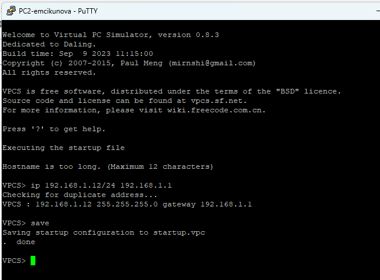{ #fig:003 width=70% height=70% }

## Проверяю соединение между узлами

{ #fig:004 width=70% height=70% }

# Анализ сетевого трафика

## Анализирую ARP-трафик

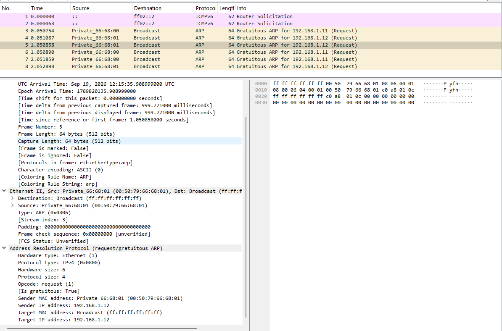{ #fig:005 width=85% height=70% }

## Анализирую ICMP-трафик

{ #fig:006 width=85% height=70% }

## Анализирую UDP-трафик

{ #fig:007 width=85% height=70% }

## Анализирую TCP-трафик

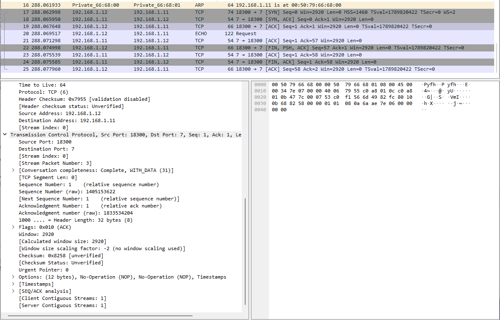{ #fig:008 width=85% height=70% }

# Моделирование сети с маршрутизатором FRR

## Настраиваю маршрутизатор FRR

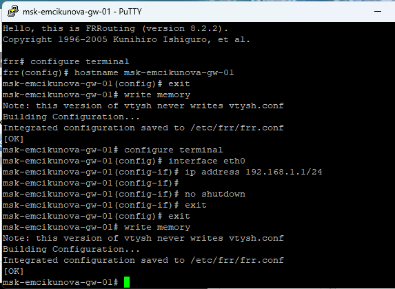{ #fig:009 width=70% height=70% }

## Проверяю конфигурацию FRR

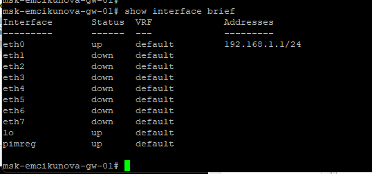{ #fig:010 width=70% height=70% }

## Проверяю соединение с FRR

С узла `PC1` выполняю `ping 192.168.1.1`. Маршрутизатор успешно отвечает на ICMP-запросы.

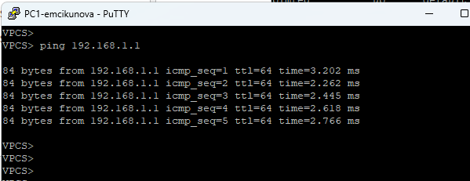{ #fig:011 width=70% height=70% }

## Анализирую трафик FRR

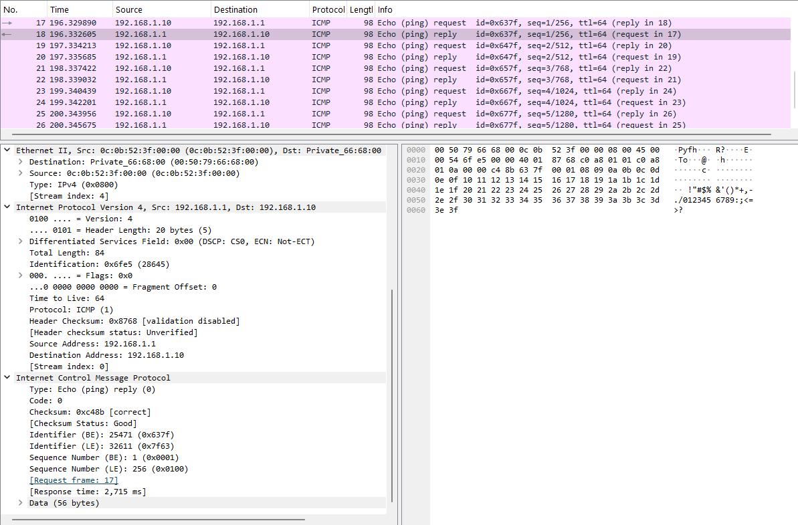{ #fig:012 width=85% height=70% }

# Моделирование сети с маршрутизатором VyOS

## Создаю топологию с VyOS

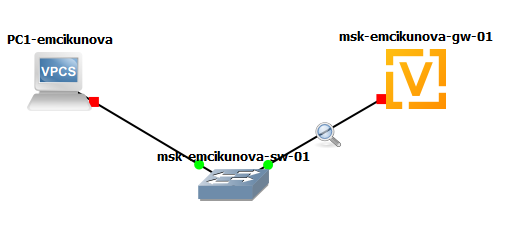{ #fig:013 width=70% height=70% }

## Настраиваю маршрутизатор VyOS

Для интерфейса `eth0` отключаю получение адреса по DHCP и задаю статический IP-адрес `192.168.1.1/24`. Применяю и сохраняю конфигурацию.

## Проверяю интерфейсы VyOS

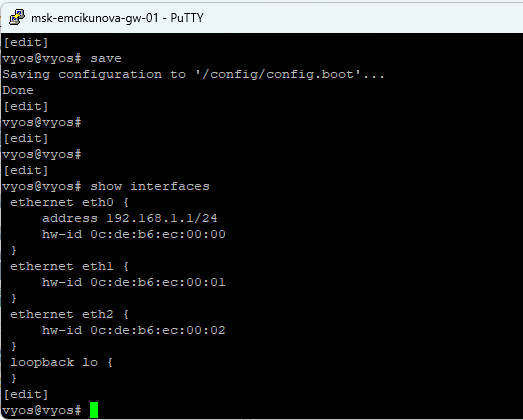{ #fig:015 width=70% height=70% }

## Проверяю соединение с VyOS

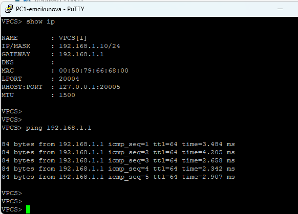{ #fig:016 width=70% height=70% }

## Анализирую трафик VyOS

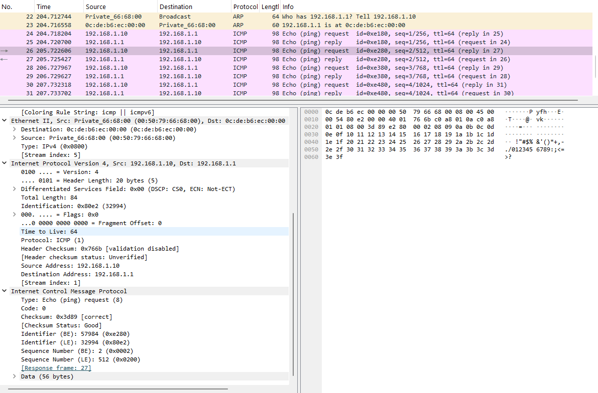{ #fig:017 width=85% height=70% }

# Вывод

## Результаты лабораторной работы

В ходе лабораторной работы были построены простые сети в GNS3 на базе Ethernet-коммутатора и маршрутизаторов FRR и VyOS.

Была настроена IP-адресация и проверена связность между устройствами. С помощью Wireshark был исследован сетевой обмен по протоколам ARP, ICMP, UDP и TCP.

Настроенные сети функционировали корректно, а передаваемые пакеты успешно достигали адресатов.