---
## Author
author:
  name:  Цыкунова Екатерина Михайловна
  email: 1132246732@rudn.ru
  affiliation:
    - name: Российский университет дружбы народов
      country: Российская Федерация
      postal-code: 117198
      city: Москва
      address: ул. Миклухо-Маклая, д. 6

## Title
title: "Отчёт по лабораторной работе №2"
subtitle: "Простые сети в GNS3. Анализ трафика"
license: "CC BY"
---

# Цель работы

Построение простейших моделей сети на базе коммутатора и маршрутизаторов FRR и VyOS в GNS3, анализ трафика посредством Wireshark.

# Выполнение лабораторной работы

## Моделирование простейшей сети на базе коммутатора в GNS3

Запускаю GNS3 VM и GNS3 и создаю новый проект. В рабочей области размещаю коммутатор Ethernet и два оконечных устройства VPCS. Переименовываю устройства в соответствии с используемой учётной записью: `PC1-emcikunova`, `PC2-emcikunova` и `msk-emcikunova-sw-01`. Соединяю оба компьютера с коммутатором Ethernet (см. рис. [@fig-001]).

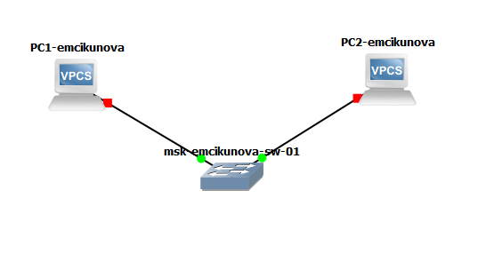{ #fig-001 width=70% }

Запускаю `PC1-emcikunova` и открываю его консоль. Для просмотра доступных команд VPCS ввожу команду `?`. В терминале отображается список команд для настройки IP-адресации, проверки соединения, просмотра параметров и сохранения конфигурации (см. рис. [@fig-002]).

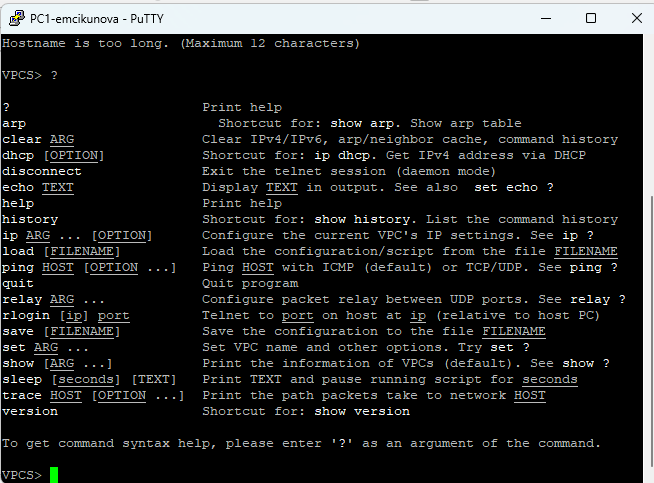{ #fig-002 width=70% }

Для первого оконечного устройства просматриваю синтаксис команды `ip`, после чего задаю IP-адрес `192.168.1.11/24` и шлюз `192.168.1.1` командой `ip 192.168.1.11/24 192.168.1.1`. Для сохранения параметров выполняю команду `save`. Конфигурация успешно сохраняется в файл `startup.vpc` (см. рис. [@fig-003]).

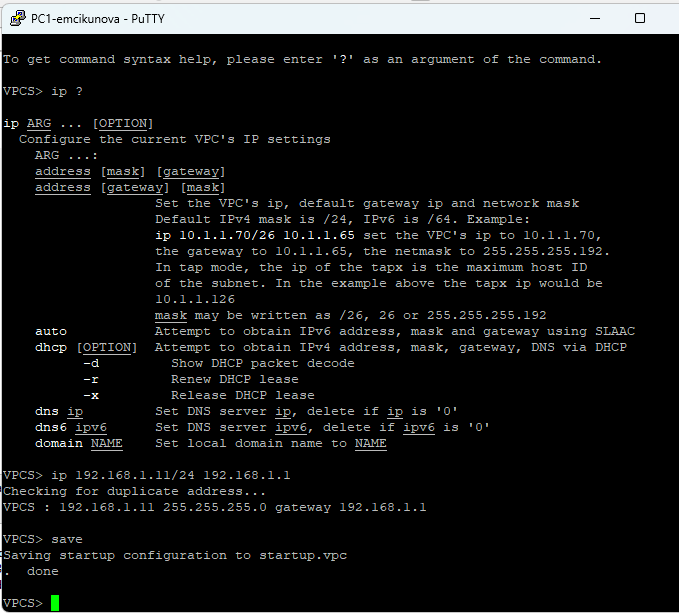{ #fig-003 width=70% }

Аналогично настраиваю второе оконечное устройство `PC2-emcikunova`. Назначаю ему IP-адрес `192.168.1.12/24` со шлюзом `192.168.1.1` и сохраняю конфигурацию командой `save` (см. рис. [@fig-004]).

{ #fig-004 width=70% }

Проверяю соединение между оконечными устройствами в обоих направлениях. С `PC1-emcikunova` выполняю `ping 192.168.1.12`, а с `PC2-emcikunova` — `ping 192.168.1.11`. Во всех случаях получаю ответы от удалённого узла, потери пакетов отсутствуют. Следовательно, устройства находятся в одной сети `192.168.1.0/24` и успешно обмениваются данными через Ethernet-коммутатор (см. рис. [@fig-005]).

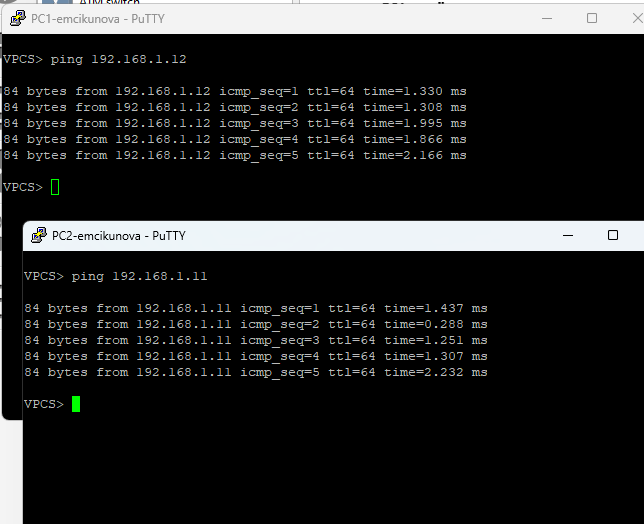{ #fig-005 width=70% }

## Анализ трафика в GNS3 посредством Wireshark

Запускаю захват трафика на соединении между `PC1-emcikunova` и коммутатором. После запуска устройств в Wireshark появляются ARP-пакеты. В захваченном трафике видны широковещательные Gratuitous ARP-запросы для адресов `192.168.1.11` и `192.168.1.12`. Ethernet-кадры передаются на широковещательный MAC-адрес `ff:ff:ff:ff:ff:ff`. Например, устройство с адресом `192.168.1.12` формирует Gratuitous ARP, в котором IP-адрес отправителя и запрашиваемый IP-адрес равны `192.168.1.12`. Подобные сообщения позволяют объявить используемый IP-адрес в локальной сети и обнаружить возможное дублирование адреса (см. рис. [@fig-006]).

{ #fig-006 width=90% }

В терминале `PC2-emcikunova` просматриваю параметры команды `ping`. VPCS позволяет выполнять проверку в трёх режимах: ICMP (`-1`), UDP (`-2`) и TCP (`-3`). Для отправки одного ICMP-запроса к `PC1-emcikunova` выполняю команду `ping 192.168.1.11 -c 1 -1`. Получаю успешный ответ от узла `192.168.1.11` (см. рис. [@fig-007]).

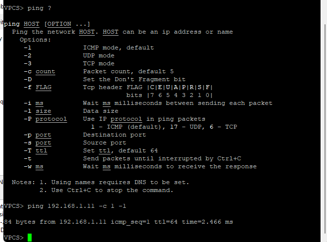{ #fig-007 width=70% }

Анализирую ICMP-обмен в Wireshark. Перед непосредственной отправкой ICMP-пакета узел `192.168.1.12` выполняет разрешение MAC-адреса узла `192.168.1.11` с помощью ARP-запроса `Who has 192.168.1.11? Tell 192.168.1.12`. В ответ узел `192.168.1.11` сообщает свой MAC-адрес `00:50:79:66:68:00`. После получения MAC-адреса передаётся ICMP `Echo (ping) request` от `192.168.1.12` к `192.168.1.11`, а затем ICMP `Echo (ping) reply` в обратном направлении. Значение TTL в захваченных пакетах равно `64` (см. рис. [@fig-008]).

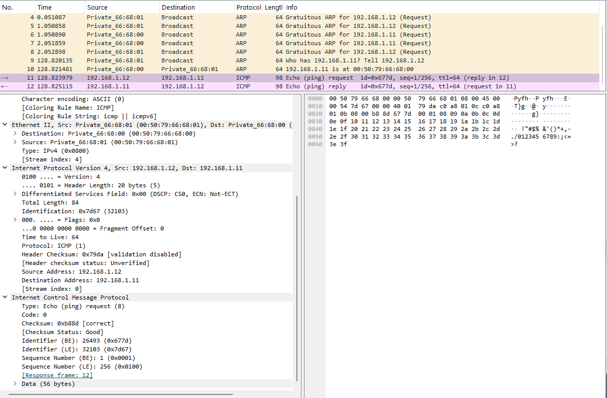{ #fig-008 width=90% }

Далее проверяю работу команды `ping` в UDP-режиме. На `PC2-emcikunova` выполняю `ping 192.168.1.11 -c 1 -2`. Получаю успешный ответ от узла `192.168.1.11` с указанием `udp_seq=1` (см. рис. [@fig-009]).

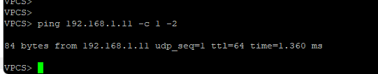{ #fig-009 width=70% }

В Wireshark наблюдаю UDP-пакет от `192.168.1.12` к `192.168.1.11`. В заголовке IPv4 указано значение `Protocol: UDP (17)`. В UDP-заголовке видно, что запрос направляется на порт `7`, соответствующий службе Echo. После запроса от `192.168.1.12` принимается ответ от `192.168.1.11`. В отличие от TCP, протокол UDP не устанавливает предварительное соединение между узлами (см. рис. [@fig-010]).

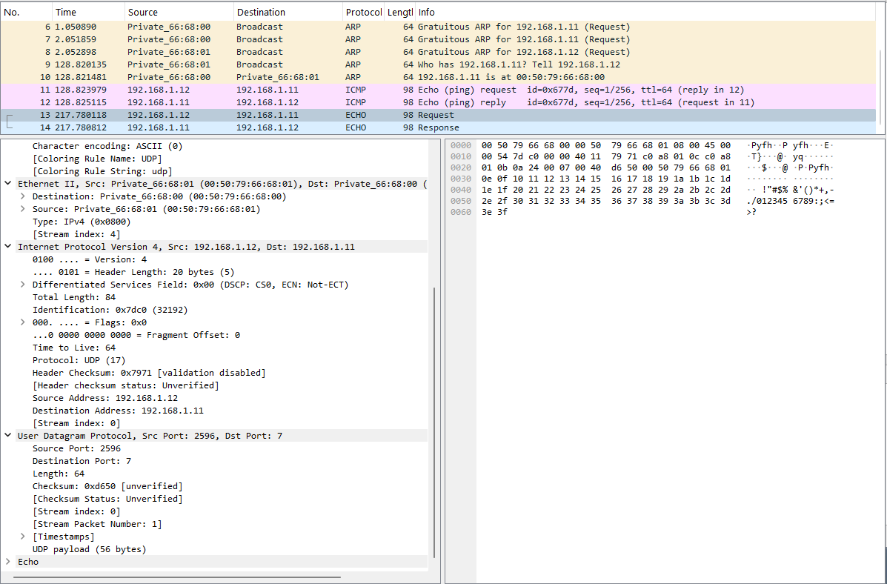{ #fig-010 width=90% }

После этого выполняю один запрос в TCP-режиме командой `ping 192.168.1.11 -c 1 -3`. В терминале отображаются этапы `Connect`, `SendData` и `Close`, что соответствует установлению TCP-соединения, передаче данных и последующему закрытию соединения (см. рис. [@fig-011]).

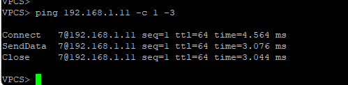{ #fig-011 width=70% }

Анализирую TCP-обмен в Wireshark. В начале соединения наблюдается стандартная последовательность установления TCP-соединения: пакет `SYN` от `192.168.1.12` к `192.168.1.11`, ответ `SYN, ACK` и завершающий пакет `ACK`. Соединение устанавливается с TCP-портом назначения `7`. После установки соединения передаётся Echo-запрос, принимается ответ, после чего начинается завершение TCP-сессии с использованием флагов `FIN` и `ACK`. В отличие от UDP, для TCP требуется предварительное установление соединения и его корректное завершение (см. рис. [@fig-012]).

{ #fig-012 width=90% }

После завершения анализа останавливаю захват пакетов в Wireshark.

## Моделирование простейшей сети на базе маршрутизатора FRR в GNS3

Создаю проект с маршрутизатором FRR, коммутатором Ethernet и одним оконечным устройством VPCS. Устройства переименовываю в соответствии с принятой схемой именования: маршрутизатор — `msk-emcikunova-gw-01`, коммутатор — `msk-emcikunova-sw-01`, оконечное устройство — `PC1-emcikunova`. На соединении между коммутатором и маршрутизатором включаю захват трафика.

На `PC1-emcikunova` задаю адрес `192.168.1.10/24` и шлюз `192.168.1.1` командой `ip 192.168.1.10/24 192.168.1.1`. Сохраняю настройки командой `save` и проверяю их командой `show ip`. В выводе отображаются IP-адрес `192.168.1.10/24` и шлюз `192.168.1.1` (см. рис. [@fig-013]).

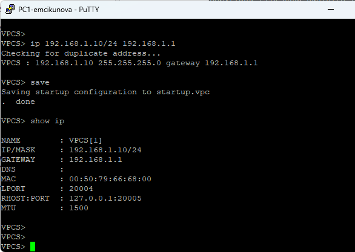{ #fig-013 width=70% }

Перехожу к настройке маршрутизатора FRR. В режиме конфигурирования изменяю имя устройства на `msk-emcikunova-gw-01` и сохраняю конфигурацию командой `write memory`. Затем перехожу к интерфейсу `eth0`, назначаю ему адрес `192.168.1.1/24` и активирую интерфейс командой `no shutdown`. После выхода из режима конфигурирования повторно сохраняю настройки. FRR подтверждает успешное сохранение конфигурации сообщением `[OK]` (см. рис. [@fig-014]).

{ #fig-014 width=70% }

Проверяю текущую конфигурацию маршрутизатора командой `show running-config`. В конфигурации присутствует имя `msk-emcikunova-gw-01`, а для интерфейса `eth0` указан адрес `192.168.1.1/24` (см. рис. [@fig-015]).

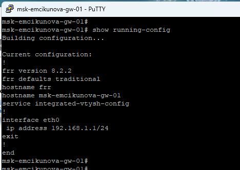{ #fig-015 width=70% }

Дополнительно выполняю команду `show interface brief`. Интерфейс `eth0` находится в состоянии `up`, принадлежит VRF `default` и использует адрес `192.168.1.1/24`. Остальные физические Ethernet-интерфейсы в данной топологии не используются и находятся в состоянии `down` (см. рис. [@fig-016]).

{ #fig-016 width=70% }

С узла `PC1-emcikunova` проверяю доступность маршрутизатора командой `ping 192.168.1.1`. Получаю пять ответов от адреса `192.168.1.1` с TTL `64`, что подтверждает корректность IP-настроек и работоспособность соединения между VPCS и маршрутизатором FRR (см. рис. [@fig-017]).

{ #fig-017 width=70% }

Анализирую полученный трафик в Wireshark. В захвате присутствуют пары ICMP `Echo (ping) request` и `Echo (ping) reply`. Запросы передаются от `192.168.1.10` к интерфейсу маршрутизатора `192.168.1.1`, а ответы — от `192.168.1.1` к `192.168.1.10`. Для каждого отправленного запроса присутствует соответствующий ответ, что подтверждает отсутствие потерь на проверяемом участке сети (см. рис. [@fig-018]).

{ #fig-018 width=90% }

После проверки останавливаю захват пакетов и все устройства проекта.

## Моделирование простейшей сети на базе маршрутизатора VyOS в GNS3

Создаю топологию, состоящую из `PC1-emcikunova`, коммутатора `msk-emcikunova-sw-01` и маршрутизатора VyOS `msk-emcikunova-gw-01`. Соединяю устройства последовательно через коммутатор. На соединении между коммутатором и маршрутизатором запускаю захват трафика, о чём свидетельствует значок анализатора на линии связи (см. рис. [@fig-019]).

{ #fig-019 width=70% }

Запускаю оконечное устройство и проверяю его IP-конфигурацию командой `show ip`. Узлу назначен адрес `192.168.1.10/24`, в качестве шлюза используется адрес `192.168.1.1` (см. рис. [@fig-020]).

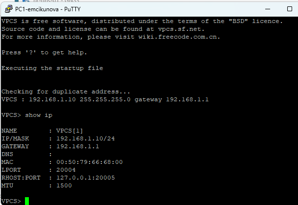{ #fig-020 width=70% }

Перехожу к настройке VyOS. Вхожу в режим конфигурирования командой `configure`, после чего задаю имя маршрутизатора командой `set system host-name msk-emcikunova-gw-01`. Удаляю получение адреса по DHCP с интерфейса `eth0` командой `del interfaces ethernet eth0 address dhcp` и назначаю статический адрес командой `set interfaces ethernet eth0 address 192.168.1.1/24`.

Командой `compare` проверяю внесённые изменения. В выводе отображается удаление параметра `address dhcp`, добавление адреса `192.168.1.1/24` и изменение имени устройства. Применяю конфигурацию командой `commit`, после чего сохраняю её командой `save`. Конфигурация успешно записывается в `/config/config.boot` (см. рис. [@fig-021]).

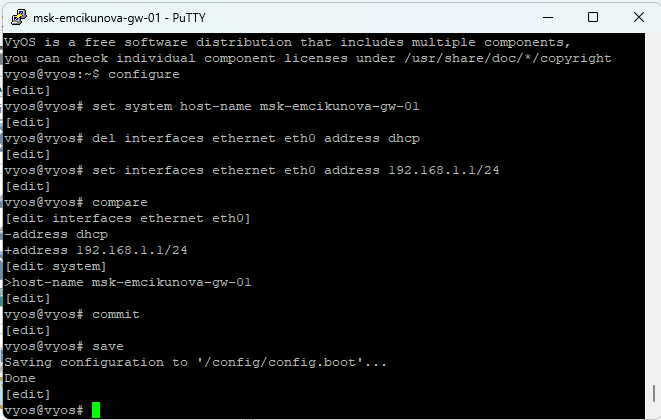{ #fig-021 width=70% }

Проверяю параметры интерфейсов маршрутизатора командой `show interfaces`. Для интерфейса `eth0` отображается настроенный адрес `192.168.1.1/24`. Интерфейсы `eth1` и `eth2` в данной топологии не используются (см. рис. [@fig-022]).

{ #fig-022 width=70% }

С узла `PC1-emcikunova` выполняю `ping 192.168.1.1`. Маршрутизатор отвечает на все пять ICMP-запросов, TTL ответов равен `64`. Полученный результат подтверждает корректность настройки интерфейса VyOS и наличие связи между оконечным устройством и маршрутизатором (см. рис. [@fig-023]).

{ #fig-023 width=70% }

Анализирую обмен в Wireshark. Перед передачей ICMP-пакетов узел `192.168.1.10` отправляет ARP-запрос `Who has 192.168.1.1? Tell 192.168.1.10`. Маршрутизатор с адресом `192.168.1.1` отвечает, сообщая свой MAC-адрес `0c:de:b6:ec:00:00`. После разрешения MAC-адреса наблюдаются ICMP `Echo (ping) request` от `192.168.1.10` к `192.168.1.1` и соответствующие `Echo (ping) reply` от маршрутизатора к оконечному устройству. Для каждого запроса присутствует ответ, поэтому соединение функционирует корректно (см. рис. [@fig-024]).

{ #fig-024 width=90% }

После завершения анализа останавливаю захват пакетов в Wireshark, останавливаю все устройства проекта и завершаю работу с GNS3.

# Вывод

В ходе лабораторной работы были построены простейшие сети в GNS3 на базе коммутатора Ethernet и маршрутизаторов FRR и VyOS. Выполнена настройка IP-адресации и проверена связность между сетевыми устройствами. С помощью Wireshark был проанализирован трафик протоколов ARP, ICMP, UDP и TCP. Все созданные соединения работали корректно, отправленные пакеты успешно достигали адресатов.