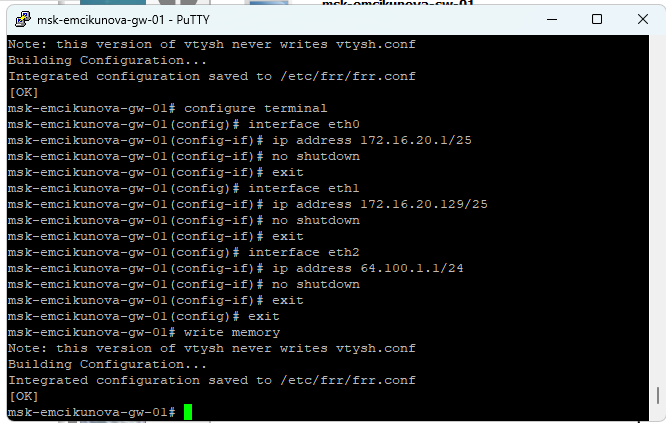
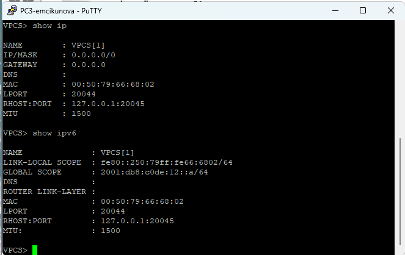
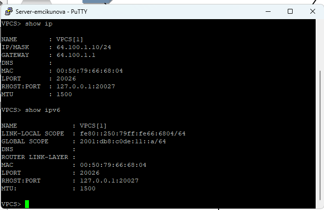
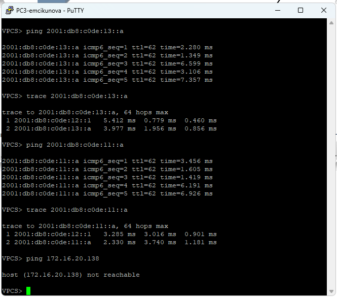
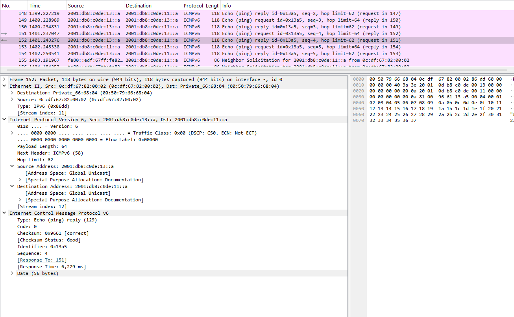
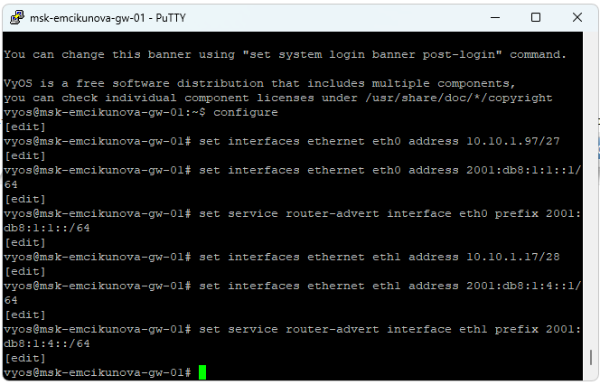
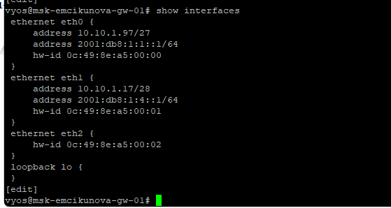

---
## Author
author:
  name:  Цыкунова Екатерина Михайловна
  email: 1132246732@rudn.ru
  affiliation:
    - name: Российский университет дружбы народов
      country: Российская Федерация
      postal-code: 117198
      city: Москва
      address: ул. Миклухо-Маклая, д. 6

## Title
title: Лабораторная работа №4
subtitle: Адресация IPv4 и IPv6. Двойной стек
license: CC BY
date: today
date-format: "YYYY-MM-DD"
---

# Цели и задачи работы

## Цель лабораторной работы

Приобретение практических навыков настройки адресации IPv4 и IPv6, организации двойного стека сетевых протоколов, маршрутизации между подсетями и анализа сетевого трафика в GNS3.

## Задачи лабораторной работы

- настроить IPv4-адресацию на оконечных устройствах и маршрутизаторе FRR;
- настроить IPv6-адресацию на оконечных устройствах и маршрутизаторе VyOS;
- организовать двойной стек IPv4 и IPv6 на сервере;
- проанализировать трафик ARP, ICMP и ICMPv6 в Wireshark;
- выполнить самостоятельное задание по настройке двух подсетей с двойным стеком адресации.

# Настройка двойного стека IPv4 и IPv6

## Создаю топологию сети

{ #fig:001 width=75% height=70% }

## Настраиваю IPv4-адресацию оконечных устройств

{ #fig:002 width=75% height=70% }

## Настраиваю IPv4-адресацию сервера

{ #fig:003 width=75% height=70% }

# Настройка маршрутизатора FRR

## Настраиваю интерфейсы FRR

{ #fig:004 width=75% height=70% }

## Проверяю конфигурацию FRR

{ #fig:005 width=75% height=70% }

## Проверяю соединение в IPv4-сети

{ #fig:006 width=75% height=70% }

# Настройка IPv6-адресации

## Настраиваю IPv6 на оконечных устройствах

{ #fig:007 width=75% height=70% }

## Настраиваю двойной стек на сервере

{ #fig:008 width=75% height=70% }

# Настройка маршрутизатора VyOS

## Настраиваю IPv6-интерфейсы VyOS

{ #fig:009 width=75% height=70% }

## Проверяю интерфейсы VyOS

{ #fig:010 width=75% height=70% }

## Проверяю соединение в IPv6-сети

{ #fig:011 width=75% height=70% }

## Проверяю работу двойного стека

{ #fig:012 width=75% height=70% }

# Анализ сетевого трафика

## Анализирую ARP-трафик

{ #fig:013 width=85% height=70% }

## Анализирую ICMP-трафик

{ #fig:014 width=85% height=70% }

## Анализирую ICMPv6-трафик

{ #fig:015 width=85% height=70% }

# Самостоятельное задание

## Определяю параметры подсетей

Для самостоятельного задания использую две подсети с двойным стеком адресации:

- Подсеть 1: `10.10.1.96/27` и `2001:db8:1:1::/64`;
- Подсеть 2: `10.10.1.16/28` и `2001:db8:1:4::/64`.

Первая IPv4-подсеть содержит 30 доступных адресов узлов, вторая — 14.

Для интерфейсов маршрутизатора выбираю наименьшие доступные адреса: `10.10.1.97/27`, `10.10.1.17/28`, `2001:db8:1:1::1/64` и `2001:db8:1:4::1/64`.

## Настраиваю маршрутизатор VyOS

{ #fig:016 width=75% height=70% }

## Проверяю конфигурацию маршрутизатора

{ #fig:017 width=75% height=70% }

## Настраиваю двойной стек на PC1 и PC2

{ #fig:018 width=75% height=70% }

## Проверяю соединение между подсетями

{ #fig:019 width=75% height=70% }

## Проверяю соединение в обратном направлении

{ #fig:020 width=75% height=70% }

# Вывод

## Результаты лабораторной работы

В ходе лабораторной работы была создана и настроена сеть в GNS3 с использованием протоколов IPv4 и IPv6.

Выполнена настройка маршрутизаторов FRR и VyOS, оконечных устройств и сервера с двойным стеком адресации. С помощью команд `ping` и `trace` проверена связность между устройствами.

В Wireshark проведён анализ трафика ARP, ICMP и ICMPv6.

В самостоятельном задании настроена маршрутизация IPv4 и IPv6 между двумя подсетями. Результаты проверок подтвердили корректность настройки адресации и работоспособность сети.