---
## Author
author:
  name:  Цыкунова Екатерина Михайловна
  email: 1132246732@rudn.ru
  affiliation:
    - name: Российский университет дружбы народов
      country: Российская Федерация
      postal-code: 117198
      city: Москва
      address: ул. Миклухо-Маклая, д. 6

## Title
title: "Отчёт по лабораторной работе №4"
subtitle: "Адресация IPv4 и IPv6. Двойной стек"
license: "CC BY"
---

# Цель работы

Изучение принципов распределения и настройки адресного пространства на устройствах сети.

# Выполнение лабораторной работы

## Настройка двойного стека адресации IPv4 и IPv6 в локальной сети

Запускаю GNS3 VM и GNS3, создаю новый проект. В рабочей области размещаю два маршрутизатора, пять коммутаторов Ethernet, четыре оконечных устройства VPCS и сервер с двойным стеком адресации. Для сети IPv4 использую маршрутизатор FRR, для сети IPv6 — маршрутизатор VyOS.

Переименовываю устройства в соответствии с используемой учётной записью: `PC1-emcikunova`, `PC2-emcikunova`, `PC3-emcikunova`, `PC4-emcikunova`, `Server-emcikunova`, `msk-emcikunova-gw-01`, `msk-emcikunova-gw-02` и коммутаторы от `msk-emcikunova-sw-01` до `msk-emcikunova-sw-05`. Соединяю устройства в соответствии с заданной топологией. На соединении сервера с коммутатором `msk-emcikunova-sw-05` включаю захват сетевого трафика для последующего анализа в Wireshark (см. рис. [@fig-001]).

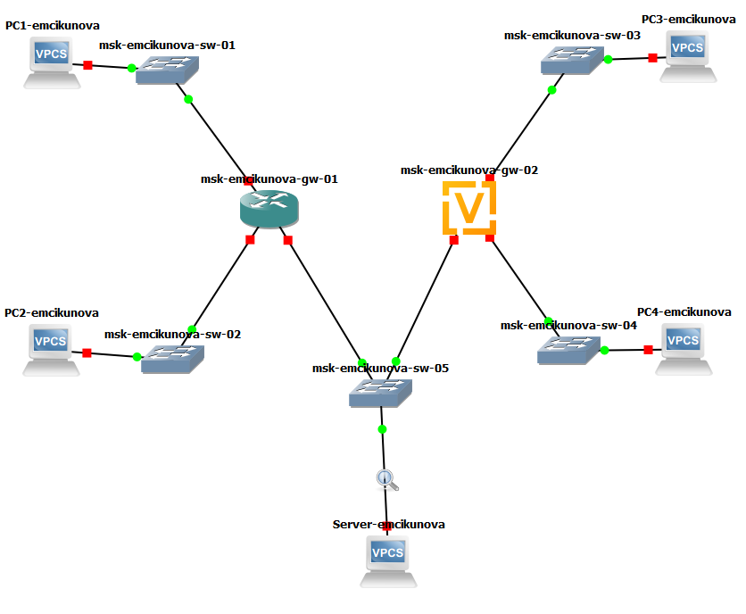{ #fig-001 width=70% }

Перехожу к настройке IPv4-адресации на оконечных устройствах первой подсети. На компьютере `PC1-emcikunova` назначаю IP-адрес `172.16.20.10/25` и шлюз по умолчанию `172.16.20.1` командой `ip 172.16.20.10/25 172.16.20.1`. Сохраняю конфигурацию командой `save`. Затем выполняю команды `show ip` и `show ipv6` для просмотра параметров сетевых протоколов. В выводе отображаются назначенный IPv4-адрес, маска подсети, шлюз по умолчанию и локальный IPv6-адрес канального уровня (см. рис. [@fig-002]).

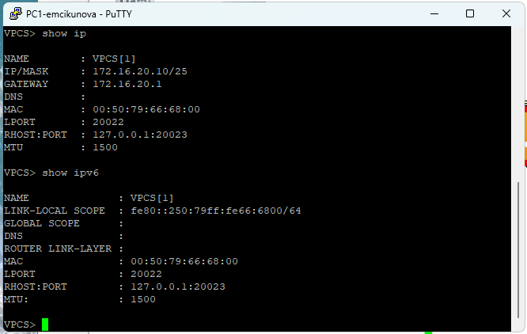{ #fig-002 width=70% }

Аналогично настраиваю компьютер `PC2-emcikunova`. Назначаю ему IPv4-адрес `172.16.20.138/25` и шлюз `172.16.20.129` командой `ip 172.16.20.138/25 172.16.20.129`. Сохраняю параметры командой `save` и проверяю их с помощью `show ip` и `show ipv6`. Убеждаюсь, что IPv4-адрес и шлюз соответствуют таблице адресации, а для IPv6 присутствует локальный адрес канального уровня (см. рис. [@fig-003]).

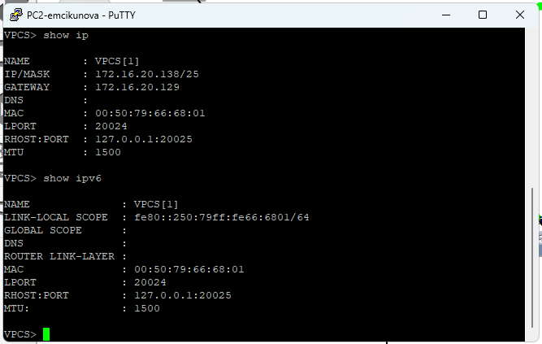{ #fig-003 width=70% }

На сервере `Server-emcikunova` настраиваю IPv4-адрес `64.100.1.10/24` со шлюзом по умолчанию `64.100.1.1` командой `ip 64.100.1.10/24 64.100.1.1`. Сохраняю конфигурацию и просматриваю текущие параметры командами `show ip` и `show ipv6`. Проверяю наличие заданного IPv4-адреса и автоматически сформированного локального IPv6-адреса (см. рис. [@fig-004]).

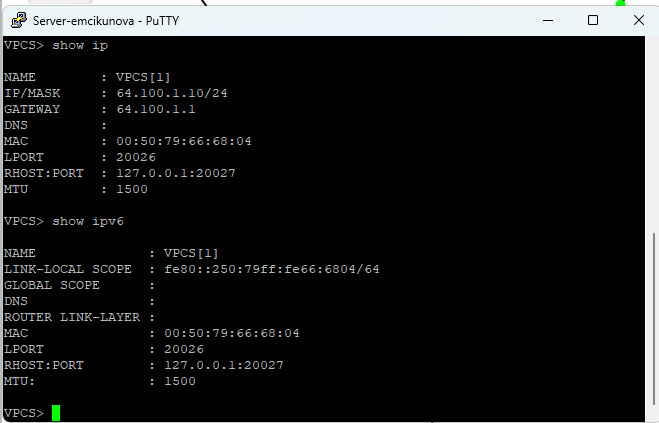{ #fig-004 width=70% }

Перехожу к настройке маршрутизатора FRR `msk-emcikunova-gw-01`. Вхожу в режим конфигурирования командой `configure terminal`, задаю имя устройства командой `hostname msk-emcikunova-gw-01` и сохраняю изменения с помощью `write memory`.

Затем настраиваю три сетевых интерфейса маршрутизатора. Для интерфейса `eth0` назначаю адрес `172.16.20.1/25`, для `eth1` — `172.16.20.129/25`, для `eth2` — `64.100.1.1/24`. На каждом интерфейсе выполняю команду `no shutdown` для его включения. После завершения настройки выхожу из режима конфигурирования и сохраняю изменения командой `write memory`. Маршрутизатор подтверждает успешное сохранение конфигурации (см. рис. [@fig-005]).

{ #fig-005 width=70% }

Для проверки сохранённых параметров маршрутизатора выполняю команду `show running-config`. В выводе отображается имя `msk-emcikunova-gw-01` и конфигурация интерфейсов `eth0`, `eth1`, `eth2` с назначенными IPv4-адресами. Убеждаюсь, что все адреса соответствуют заданной таблице адресации (см. рис. [@fig-006]).

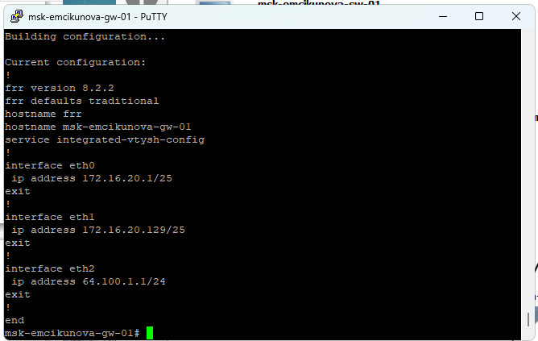{ #fig-006 width=70% }

Дополнительно выполняю команду `show interface brief` для проверки состояния сетевых интерфейсов маршрутизатора. В таблице отображаются интерфейсы `eth0`, `eth1`, `eth2`, их IPv4-адреса и состояние `up`. Это подтверждает, что интерфейсы активны и готовы к передаче пакетов (см. рис. [@fig-007]).

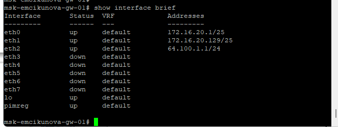{ #fig-007 width=70% }

Проверяю связность между устройствами IPv4-подсетей. На компьютере `PC1-emcikunova` выполняю команду `ping 172.16.20.138` для проверки доступности `PC2-emcikunova`. Получаю ответы на ICMP-запросы, что подтверждает наличие соединения между устройствами через маршрутизатор.

Затем выполняю `trace 172.16.20.138`, чтобы определить маршрут прохождения пакетов. В выводе первым узлом отображается шлюз `172.16.20.1`, а вторым — целевой адрес `172.16.20.138`.

После этого проверяю доступность сервера командами `ping 64.100.1.10` и `trace 64.100.1.10`. Сервер отвечает на ICMP-запросы, маршрут проходит через шлюз `172.16.20.1`. Сообщение `Destination port unreachable` на конечном узле при выполнении `trace` связано с особенностями трассировки с использованием UDP-пакетов и не свидетельствует о недоступности сервера, поскольку проверка `ping` завершается успешно (см. рис. [@fig-008]).

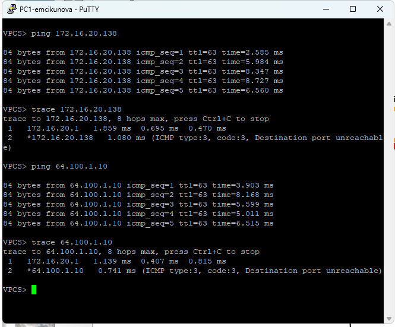{ #fig-008 width=70% }

На компьютере `PC2-emcikunova` аналогично выполняю проверку соединения с `PC1-emcikunova` командой `ping 172.16.20.10`. Получаю ответы от узла `172.16.20.10`. Команда `trace 172.16.20.10` показывает прохождение пакетов через шлюз `172.16.20.129`.

Затем выполняю `ping 64.100.1.10` и `trace 64.100.1.10` для проверки соединения с сервером. Сервер отвечает на запросы, а трассировка показывает передачу пакетов через маршрутизатор `msk-emcikunova-gw-01`. Подтверждаю работоспособность IPv4-маршрутизации между всеми тремя подсетями, подключёнными к FRR (см. рис. [@fig-009]).

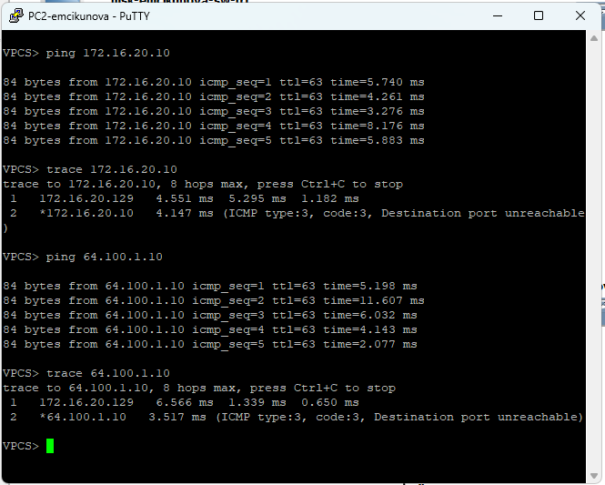{ #fig-009 width=70% }

Перехожу к настройке IPv6-адресации второй части сети. На компьютере `PC3-emcikunova` назначаю IPv6-адрес `2001:db8:c0de:12::a/64` командой `ip 2001:db8:c0de:12::a/64` и сохраняю конфигурацию командой `save`.

Выполняю команды `show ip` и `show ipv6`. Проверяю, что IPv4-адрес на данном устройстве не настроен, а в разделе `GLOBAL SCOPE` указан IPv6-адрес `2001:db8:c0de:12::a/64`. Также отображается локальный адрес IPv6 из диапазона `fe80::/10` (см. рис. [@fig-010]).

{ #fig-010 width=70% }

На компьютере `PC4-emcikunova` назначаю адрес `2001:db8:c0de:13::a/64` командой `ip 2001:db8:c0de:13::a/64`. Сохраняю конфигурацию и проверяю параметры командами `show ip` и `show ipv6`. В результате убеждаюсь, что глобальный IPv6-адрес соответствует заданной подсети `2001:db8:c0de:13::/64`, а IPv4-адрес отсутствует (см. рис. [@fig-011]).

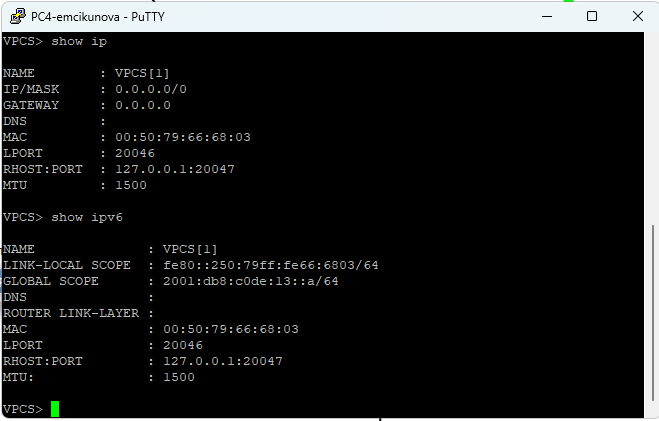{ #fig-011 width=70% }

На сервере двойного стека дополнительно настраиваю IPv6-адрес `2001:db8:c0de:11::a/64` командой `ip 2001:db8:c0de:11::a/64`. Сохраняю параметры командой `save`.

Повторно выполняю `show ip` и `show ipv6`. В выводе присутствуют IPv4-адрес `64.100.1.10/24` и IPv6-адрес `2001:db8:c0de:11::a/64`. Следовательно, сервер одновременно использует оба протокола сетевого уровня и может обмениваться пакетами с устройствами IPv4- и IPv6-подсетей при наличии соответствующих маршрутов (см. рис. [@fig-012]).

{ #fig-012 width=70% }

Для настройки IPv6-маршрутизации открываю консоль маршрутизатора VyOS. Вхожу в режим конфигурирования командой `configure` и изменяю имя устройства с помощью `set system host-name msk-emcikunova-gw-02`.

Удаляю настройку автоматического получения IPv4-адреса для интерфейса `eth0` командой `delete interfaces ethernet eth0 address dhcp`. Для просмотра изменений выполняю `compare`. После этого применяю изменения командой `commit`, сохраняю конфигурацию командой `save` и выхожу из режима настройки командой `exit`. Для применения нового имени устройства выполняю перезагрузку маршрутизатора командой `reboot` (см. рис. [@fig-013]).

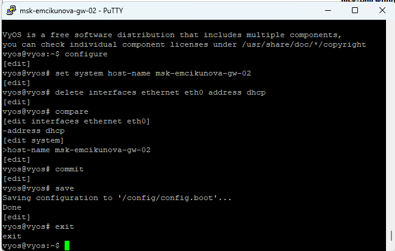{ #fig-013 width=70% }

После перезагрузки маршрутизатора `msk-emcikunova-gw-02` снова перехожу в режим конфигурирования. Назначаю IPv6-адреса трём интерфейсам маршрутизатора:

- `eth0` — `2001:db8:c0de:12::1/64`;
- `eth1` — `2001:db8:c0de:13::1/64`;
- `eth2` — `2001:db8:c0de:11::1/64`.

Для назначения адресов использую команды `set interfaces ethernet eth0 address 2001:db8:c0de:12::1/64`, `set interfaces ethernet eth1 address 2001:db8:c0de:13::1/64` и `set interfaces ethernet eth2 address 2001:db8:c0de:11::1/64`.

Дополнительно настраиваю отправку сообщений Router Advertisement для каждой подсети командами `set service router-advert interface eth0 prefix 2001:db8:c0de:12::/64`, `set service router-advert interface eth1 prefix 2001:db8:c0de:13::/64` и `set service router-advert interface eth2 prefix 2001:db8:c0de:11::/64`. Эти сообщения позволяют оконечным устройствам получать информацию о маршрутизаторе и префиксе соответствующей IPv6-подсети (см. рис. [@fig-014]).

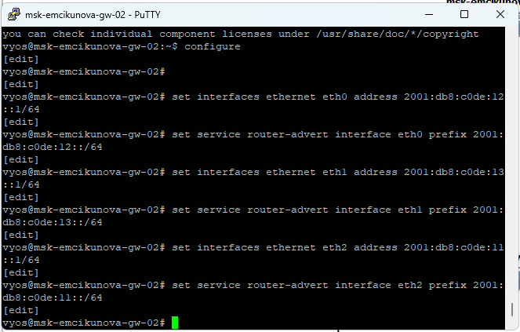{ #fig-014 width=70% }

Для предварительной проверки введённых параметров выполняю команду `compare`. В выводе отображаются добавленные IPv6-адреса интерфейсов `eth0`, `eth1`, `eth2`, а также префиксы, используемые службой Router Advertisement. Проверяю соответствие адресов заданной схеме сети, после чего применяю изменения командой `commit` и сохраняю конфигурацию с помощью `save` (см. рис. [@fig-015]).

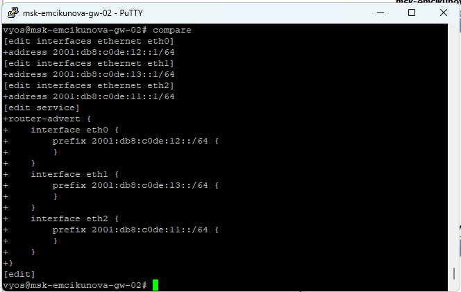{ #fig-015 width=70% }

После настройки выполняю команду `show interfaces`. В выводе отображаются назначенные интерфейсам маршрутизатора IPv6-адреса: `2001:db8:c0de:12::1/64`, `2001:db8:c0de:13::1/64` и `2001:db8:c0de:11::1/64`. Убеждаюсь, что все три интерфейса имеют адреса из соответствующих подсетей (см. рис. [@fig-016]).

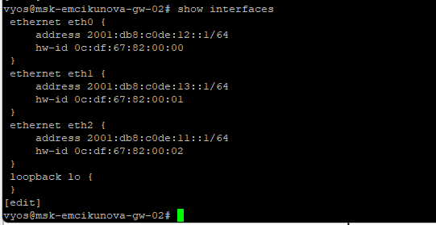{ #fig-016 width=70% }

Перехожу к проверке связности устройств IPv6-сети. На компьютере `PC3-emcikunova` выполняю команду `ping 2001:db8:c0de:13::a` для проверки доступности `PC4-emcikunova`. Получаю ответы на ICMPv6 Echo Request. Команда `trace 2001:db8:c0de:13::a` показывает маршрут через шлюз `2001:db8:c0de:12::1` к устройству `2001:db8:c0de:13::a`.

Затем проверяю доступность сервера командами `ping 2001:db8:c0de:11::a` и `trace 2001:db8:c0de:11::a`. Сервер успешно отвечает на запросы, а трассировка подтверждает прохождение пакетов через IPv6-маршрутизатор.

Для проверки разделения сетей выполняю `ping 172.16.20.138`. Получаю сообщение `host not reachable`, поскольку на `PC3-emcikunova` не настроена IPv4-адресация и отсутствует механизм взаимодействия с IPv4-подсетью (см. рис. [@fig-017]).

{ #fig-017 width=70% }

На компьютере `PC4-emcikunova` выполняю проверку соединения с `PC3-emcikunova` командой `ping 2001:db8:c0de:12::a` и определяю маршрут с помощью `trace 2001:db8:c0de:12::a`. Узел успешно отвечает на ICMPv6-запросы. Маршрут проходит через интерфейс маршрутизатора с адресом `2001:db8:c0de:13::1`.

Аналогично проверяю доступность сервера командами `ping 2001:db8:c0de:11::a` и `trace 2001:db8:c0de:11::a`. Получаю ответы от сервера, что подтверждает работу IPv6-маршрутизации.

При выполнении `ping 64.100.1.10` получаю сообщение `host not reachable`. Это подтверждает отсутствие прямого обмена IPv4-пакетами с устройства, настроенного только для IPv6 (см. рис. [@fig-018]).

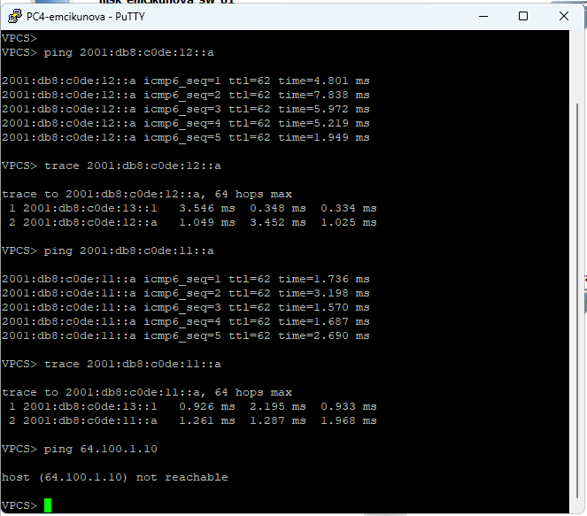{ #fig-018 width=70% }

Проверяю возможность взаимодействия сервера двойного стека с устройствами обеих частей сети. В консоли `Server-emcikunova` выполняю команду `ping 172.16.20.10`. Компьютер `PC1-emcikunova` успешно отвечает на ICMP-запросы по протоколу IPv4.

После этого выполняю `ping 2001:db8:c0de:12::a`. Получаю ответы от `PC3-emcikunova` по протоколу ICMPv6. Результаты подтверждают, что сервер имеет возможность взаимодействовать как с IPv4-, так и с IPv6-устройствами (см. рис. [@fig-019]).

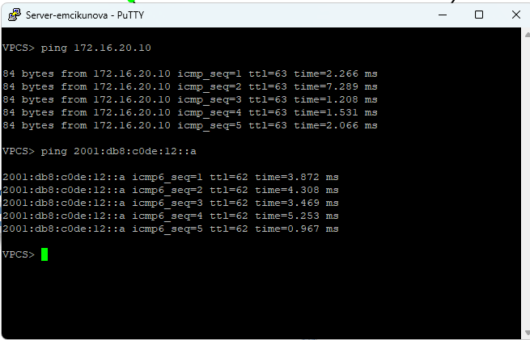{ #fig-019 width=70% }

Дополнительно с сервера выполняю `ping 172.16.20.138` для проверки доступности `PC2-emcikunova`, а затем `ping 2001:db8:c0de:13::a` для проверки соединения с `PC4-emcikunova`. В обоих случаях получаю ответы на эхо-запросы.

Убеждаюсь, что сервер двойного стека может взаимодействовать со всеми четырьмя оконечными устройствами, используя соответствующий протокол IP. При этом непосредственный обмен данными между устройствами, работающими только с IPv4, и устройствами, работающими только с IPv6, не обеспечивается, поскольку трансляция протоколов в созданной сети не настроена (см. рис. [@fig-020]).

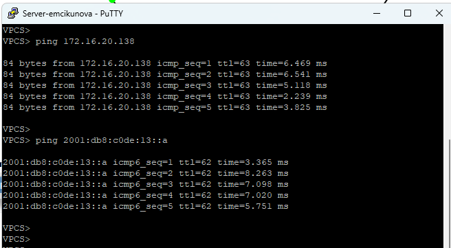{ #fig-020 width=70% }

Для анализа сетевого обмена открываю в Wireshark захваченный трафик на соединении сервера `Server-emcikunova` с коммутатором `msk-emcikunova-sw-05`.

В списке пакетов нахожу ARP-запрос от устройства с IPv4-адресом `64.100.1.1`, предназначенный для определения MAC-адреса узла `64.100.1.10`. В поле информации отображается сообщение `Who has 64.100.1.10? Tell 64.100.1.1`. В подробных сведениях о пакете указан MAC-адрес отправителя `0c:a3:13:d4:00:02`, тип операции `request` и искомый IPv4-адрес.

Следом отображается ARP-ответ `64.100.1.10 is at 00:50:79:66:68:04`. В результате маршрутизатор получает информацию о соответствии IPv4-адреса сервера его MAC-адресу.

ARP используется для определения адреса канального уровня по известному IPv4-адресу в пределах локального сегмента сети. В захваченных пакетах можно определить IP- и MAC-адреса участников обмена, тип операции, адрес запрашиваемого устройства и результат разрешения адреса (см. рис. [@fig-021]).

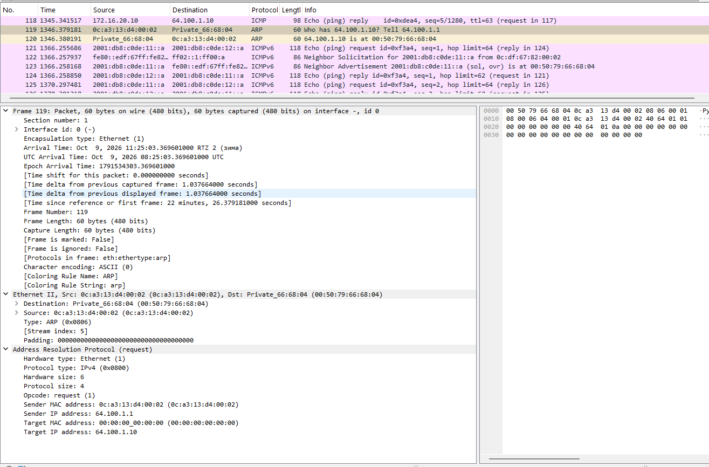{ #fig-021 width=70% }

Далее анализирую пакеты ICMP, возникающие при выполнении команды `ping` в IPv4-сети. В Wireshark выбираю ICMP Echo Request, отправленный с адреса `172.16.20.138` на адрес сервера `64.100.1.10`.

В структуре пакета просматриваю заголовок IPv4 с адресами источника и назначения, значением TTL, длиной пакета и используемым протоколом ICMP. В разделе ICMP отображаются тип сообщения `8` (Echo Request), код `0`, контрольная сумма, идентификатор и порядковый номер запроса.

В списке пакетов также присутствуют ответы Echo Reply. По идентификаторам и порядковым номерам можно сопоставить запросы с ответами, а по временным отметкам определить задержку передачи.

Полученные данные позволяют проследить обмен ICMP-сообщениями между устройствами IPv4-сети, определить направление передачи пакетов и проверить работоспособность соединения (см. рис. [@fig-022]).

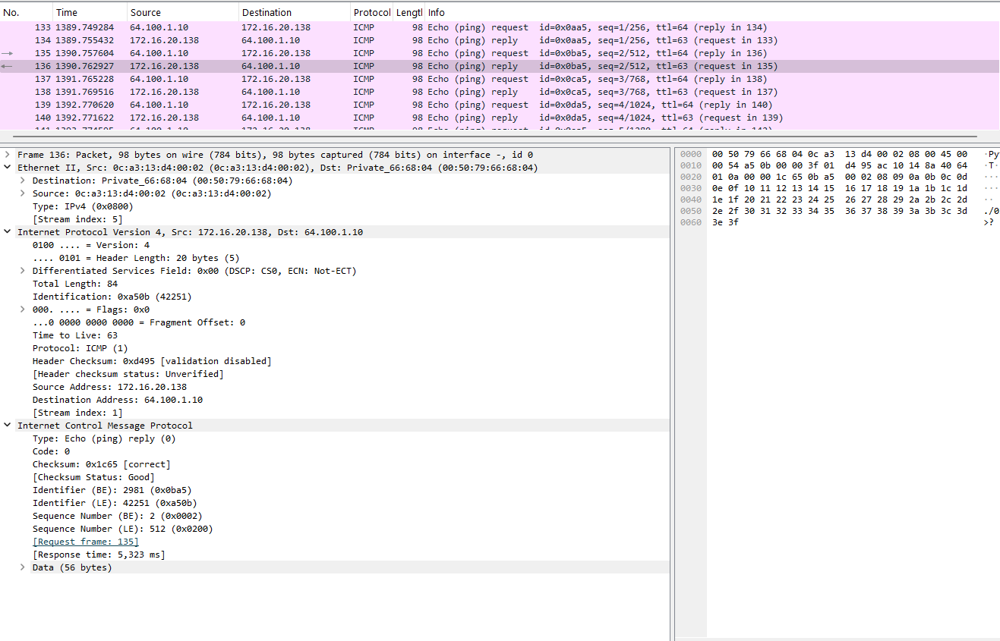{ #fig-022 width=70% }

Для анализа IPv6-трафика выбираю пакет ICMPv6 Echo Reply, отправленный с IPv6-адреса `2001:db8:c0de:13::a` на адрес сервера `2001:db8:c0de:11::a`.

В заголовке IPv6 отображаются адреса источника и назначения, версия протокола `6`, длина полезной нагрузки, значение `Hop Limit` и поле `Next Header`, указывающее на ICMPv6.

В разделе ICMPv6 отображается тип сообщения `129` (Echo Reply), код `0`, контрольная сумма, идентификатор и номер последовательности. В захваченном пакете также можно определить время ответа на соответствующий эхо-запрос.

Кроме эхо-запросов и ответов, в захваченном трафике присутствуют сообщения `Neighbor Solicitation` и `Neighbor Advertisement`. Они относятся к механизму Neighbor Discovery, который используется в IPv6 для обнаружения соседних устройств и определения их адресов канального уровня вместо ARP.

Анализ показывает, что сервер одновременно участвует в обмене IPv4- и IPv6-пакетами. Для IPv4 используется ARP и ICMP, а для IPv6 — ICMPv6, включая сообщения обнаружения соседей и проверки доступности (см. рис. [@fig-023]).

{ #fig-023 width=70% }

## Самостоятельное задание. Настройка двойного стека IPv4 и IPv6 в двух локальных подсетях

Для самостоятельного задания использую топологию с двумя локальными подсетями, соединёнными маршрутизатором VyOS. Каждая подсеть использует одновременно IPv4- и IPv6-адресацию.

Для первой подсети выделены адресные пространства `10.10.1.96/27` и `2001:db8:1:1::/64`. Для второй — `10.10.1.16/28` и `2001:db8:1:4::/64`.

Сначала определяю характеристики IPv4-подсетей.

Для подсети `10.10.1.96/27` маска равна `255.255.255.224`. Длина сетевой части составляет 27 бит, для адресов узлов остаётся 5 бит. Общее количество адресов составляет 32, из них 30 доступны для назначения устройствам. Адрес сети — `10.10.1.96`, первый доступный адрес — `10.10.1.97`, последний — `10.10.1.126`, широковещательный адрес — `10.10.1.127`.

Для подсети `10.10.1.16/28` маска равна `255.255.255.240`. Длина сетевой части составляет 28 бит, для адресов узлов остаётся 4 бита. Всего подсеть содержит 16 адресов, из которых 14 доступны устройствам. Адрес сети — `10.10.1.16`, первый доступный адрес — `10.10.1.17`, последний — `10.10.1.30`, широковещательный адрес — `10.10.1.31`.

Характеристики IPv4-подсетей представлены в таблице.

| Параметр | Подсеть 1 | Подсеть 2 |
|---|---|---|
| Адрес сети | `10.10.1.96/27` | `10.10.1.16/28` |
| Маска | `255.255.255.224` | `255.255.255.240` |
| Первый адрес узла | `10.10.1.97` | `10.10.1.17` |
| Последний адрес узла | `10.10.1.126` | `10.10.1.30` |
| Широковещательный адрес | `10.10.1.127` | `10.10.1.31` |
| Всего адресов | 32 | 16 |
| Доступно узлам | 30 | 14 |

Для IPv6 использую префиксы `2001:db8:1:1::/64` и `2001:db8:1:4::/64`. В каждой из этих подсетей для идентификатора интерфейса выделено 64 бита. Адреса с окончанием `::1` назначаю интерфейсам маршрутизатора, а адреса с окончанием `::a` — оконечным устройствам.

В соответствии с требованием использовать наименьшие доступные адреса для маршрутизатора составляю таблицу адресации.

| Устройство | Интерфейс | IPv4-адрес | IPv6-адрес | Шлюз IPv4 |
|---|---|---|---|---|
| `msk-emcikunova-gw-01` | `eth0` | `10.10.1.97/27` | `2001:db8:1:1::1/64` | — |
| `msk-emcikunova-gw-01` | `eth1` | `10.10.1.17/28` | `2001:db8:1:4::1/64` | — |
| `PC1-emcikunova` | `NIC` | `10.10.1.100/27` | `2001:db8:1:1::a/64` | `10.10.1.97` |
| `PC2-emcikunova` | `NIC` | `10.10.1.20/28` | `2001:db8:1:4::a/64` | `10.10.1.17` |

Для реализации сети использую маршрутизатор VyOS и два оконечных устройства VPCS. Подключаю компьютеры к соответствующим интерфейсам маршрутизатора через локальные сегменты сети.

Перехожу в консоль маршрутизатора `msk-emcikunova-gw-01` и вхожу в режим конфигурирования командой `configure`. Для интерфейса `eth0` назначаю IPv4-адрес `10.10.1.97/27` командой `set interfaces ethernet eth0 address 10.10.1.97/27` и IPv6-адрес `2001:db8:1:1::1/64` командой `set interfaces ethernet eth0 address 2001:db8:1:1::1/64`.

Для интерфейса `eth1` задаю адреса `10.10.1.17/28` и `2001:db8:1:4::1/64`.

Дополнительно включаю отправку Router Advertisement для соответствующих IPv6-подсетей командами `set service router-advert interface eth0 prefix 2001:db8:1:1::/64` и `set service router-advert interface eth1 prefix 2001:db8:1:4::/64`. Это позволяет оконечным устройствам получить информацию об IPv6-префиксе и маршрутизаторе по умолчанию (см. рис. [@fig-024]).

{ #fig-024 width=70% }

После ввода параметров применяю конфигурацию командой `commit` и сохраняю изменения командой `save`. Для проверки выполняю `show interfaces`.

В выводе вижу, что интерфейсу `eth0` назначены адреса `10.10.1.97/27` и `2001:db8:1:1::1/64`, а интерфейсу `eth1` — `10.10.1.17/28` и `2001:db8:1:4::1/64`. Интерфейс `eth2` не используется в данной схеме и IP-адресов не имеет. Проверяю соответствие параметров составленной таблице адресации (см. рис. [@fig-025]).

{ #fig-025 width=70% }

Перехожу к настройке первого компьютера `PC1-emcikunova`. Назначаю IPv4-адрес `10.10.1.100/27` и шлюз `10.10.1.97` командой `ip 10.10.1.100/27 10.10.1.97`. Для IPv6 использую адрес `2001:db8:1:1::a/64`. Сохраняю настройки командой `save`.

Затем выполняю `show ip` и `show ipv6`. В выводе отображается IPv4-адрес `10.10.1.100/27`, шлюз `10.10.1.97` и IPv6-адрес `2001:db8:1:1::a/64`. Также присутствует локальный IPv6-адрес и информация о маршрутизаторе канального уровня, полученная по механизму Neighbor Discovery (см. рис. [@fig-026]).

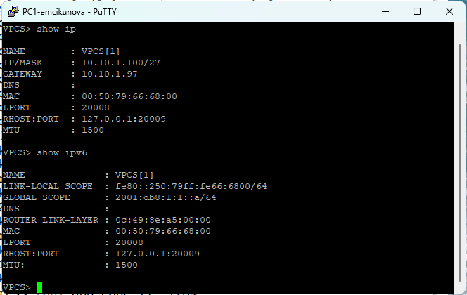{ #fig-026 width=70% }

После настройки проверяю доступность второго компьютера с `PC1-emcikunova`. Сначала выполняю команду `ping 10.10.1.20`. Получаю ответы от `PC2-emcikunova`, что подтверждает успешную передачу IPv4-пакетов между подсетями.

Команда `trace 10.10.1.20` показывает прохождение пакетов через маршрутизатор `10.10.1.97` к адресу `10.10.1.20`. На конечном узле отображается сообщение `ICMP type:3, code:3, Destination port unreachable`, возникающее при обработке трассировочных UDP-пакетов.

Затем проверяю IPv6-соединение командой `ping 2001:db8:1:4::a`. Получаю ответы ICMPv6 от второго компьютера. Выполняю `trace 2001:db8:1:4::a`. В результате первым узлом маршрута отображается `2001:db8:1:1::1`, вторым — `2001:db8:1:4::a`.

Убеждаюсь, что маршрутизатор VyOS успешно передаёт IPv4- и IPv6-пакеты между двумя локальными подсетями (см. рис. [@fig-027]).

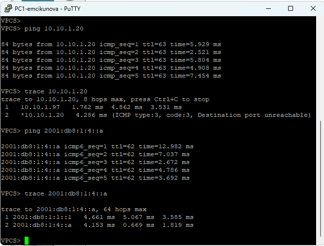{ #fig-027 width=70% }

Перехожу к настройке второго компьютера `PC2-emcikunova`. Назначаю IPv4-адрес `10.10.1.20/28` и шлюз по умолчанию `10.10.1.17` командой `ip 10.10.1.20/28 10.10.1.17`. Для IPv6 использую адрес `2001:db8:1:4::a/64`. Сохраняю конфигурацию командой `save`.

Проверяю текущую адресацию с помощью `show ip` и `show ipv6`. В выводе отображаются корректные значения IPv4-адреса и шлюза, а также глобальный IPv6-адрес `2001:db8:1:4::a/64`. Подтверждаю, что оба протокола IP настроены на одном оконечном устройстве (см. рис. [@fig-028]).

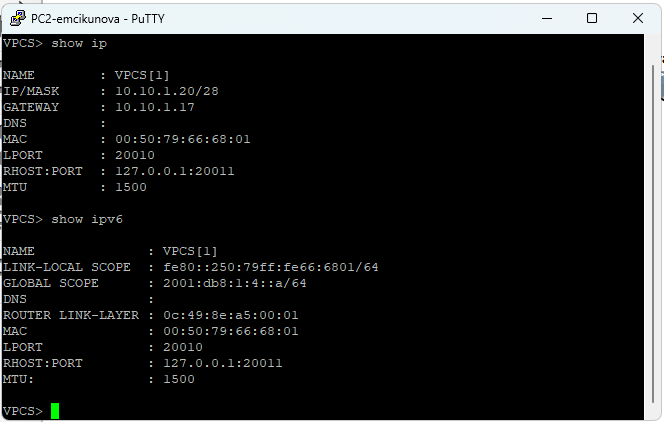{ #fig-028 width=70% }

Для завершающей проверки выполняю тестирование связи с компьютера `PC2-emcikunova` до `PC1-emcikunova`.

Сначала выполняю `ping 10.10.1.100`. Получаю ответы на все пять ICMP-запросов. Команда `trace 10.10.1.100` показывает передачу пакетов через шлюз `10.10.1.17` к конечному адресу `10.10.1.100`.

Затем выполняю IPv6-проверку командой `ping 2001:db8:1:1::a`. Все эхо-запросы получают ответы от первого компьютера. Трассировка `trace 2001:db8:1:1::a` показывает два перехода: через интерфейс маршрутизатора `2001:db8:1:4::1` и далее к узлу `2001:db8:1:1::a`.

Результаты проверки подтверждают успешную двустороннюю передачу пакетов по протоколам IPv4 и IPv6 между двумя подсетями. Маршрутизатор VyOS обеспечивает маршрутизацию для обоих протоколов, а оконечные устройства используют двойной стек адресации (см. рис. [@fig-029]).

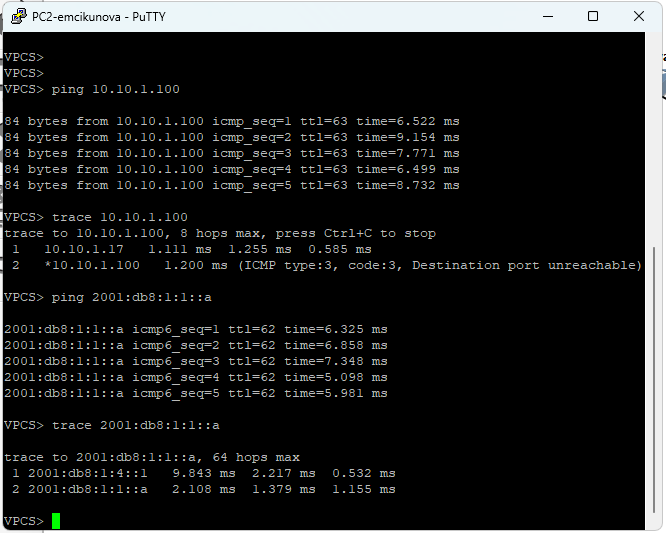{ #fig-029 width=70% }

# Вывод

В ходе лабораторной работы была создана и настроена сеть в GNS3 с использованием протоколов IPv4 и IPv6. Выполнена настройка маршрутизаторов FRR и VyOS, оконечных устройств и сервера с двойным стеком адресации. С помощью команд `ping` и `trace` проверена связность между устройствами. В Wireshark проведён анализ трафика ARP, ICMP и ICMPv6. В самостоятельном задании настроена маршрутизация IPv4 и IPv6 между двумя подсетями. Результаты проверок подтвердили корректность настройки адресации и работоспособность сети.

# Список литературы

1. [Королькова А. В., Кулябов Д. С. Сетевые технологии. Лабораторные работы: учебное пособие. — М.: РУДН, 2014. — 106 с.](https://repository.rudn.ru/ru/records/manual/record/56143/)

2. [GNS3 Documentation. Getting Started with GNS3 — официальная документация по созданию и моделированию компьютерных сетей](https://docs.gns3.com/docs)

3. [GNS3 Documentation. VPCS Configuration — настройка виртуальных компьютеров, IP-адресации и проверка сетевых соединений](https://docs.gns3.com/docs-3.1-en/web-ui/template-preferences-vpcs)

4. [FRRouting Documentation. Zebra — настройка сетевых интерфейсов и IP-маршрутизации в FRR](https://docs.frrouting.org/en/latest/zebra.html)

5. [VyOS Documentation. Ethernet Interfaces — настройка IPv4- и IPv6-адресации на интерфейсах маршрутизатора VyOS](https://docs.vyos.io/en/rolling/configuration/interfaces/ethernet.html)

6. [VyOS Documentation. Router Advertisements — настройка рассылки IPv6-префиксов и автоматической конфигурации узлов](https://docs.vyos.io/en/rolling/configuration/service/router-advert.html)

7. [Wireshark Foundation. Wireshark User's Guide — руководство по захвату и анализу сетевого трафика](https://www.wireshark.org/docs/wsug_html/)

8. [RFC 792. Postel J. Internet Control Message Protocol (ICMP). — IETF, 1981](https://www.rfc-editor.org/info/rfc792/)

9. [RFC 826. Plummer D. An Ethernet Address Resolution Protocol (ARP). — IETF, 1982](https://www.rfc-editor.org/info/rfc826/)

10. [RFC 4443. Conta A., Deering S., Gupta M. Internet Control Message Protocol (ICMPv6) for IPv6. — IETF, 2006](https://www.rfc-editor.org/info/rfc4443/)

11. [RFC 4861. Narten T., Nordmark E., Simpson W., Soliman H. Neighbor Discovery for IP Version 6 (IPv6). — IETF, 2007](https://www.rfc-editor.org/info/rfc4861/)

12. [RFC 8200. Deering S., Hinden R. Internet Protocol, Version 6 (IPv6) Specification. — IETF, 2017](https://www.rfc-editor.org/info/rfc8200/)
